# 11 — Integración de IA y MCP (Model Context Protocol)

## Objetivo de este capítulo

Al terminar este capítulo podrás **definir, distinguir e evaluar** cómo la inteligencia artificial generativa se integra en el ciclo de vida del software y qué protocolos estandarizan esa integración. No se trata de memorizar prompts de moda, sino de entender **qué problema resuelve cada enfoque** (prompt engineering, RAG, fine-tuning, agentes, MCP), sus **limitaciones reales** y las **decisiones de gobernanza** que todo equipo debe tomar antes de conectar un modelo a sistemas de producción.

Asumimos que ya sabes programar, usar un IDE y colaborar en equipos con control de versiones. Si has usado un chatbot para preguntar sobre código, ya tienes la base para entender por qué eso no basta en un flujo profesional.

Conceptos que dominarás:

- IA generativa en cada fase del SDLC.
- Prompt engineering: técnicas y buenas prácticas.
- RAG: embedding, chunking, retrieval y pipeline completo.
- Fine-tuning vs RAG: cuándo elegir cada enfoque.
- Agentes de IA y el bucle planificar-ejecutar-observar.
- MCP: host, client, server, tools, resources, prompts.
- Context window: limitaciones y estrategias.
- Seguridad, gobernanza y AIOps.
- Diagramas asistidos por IA (draw.io MCP).

> **Cómo leer este capítulo:** cada concepto mayor sigue la misma estructura: definición formal → explicación desarrollada → diagrama → cuándo usarlo. No te saltes las secciones de seguridad — integrar IA sin gobernanza es un riesgo operativo y legal.

---

## 1. Introducción: la IA como capa de productividad

Hace unos años, la IA generativa era una curiosidad académica o un demo impresionante. Hoy es una **capa transversal** en diseño, implementación, pruebas, operaciones y documentación de software. Pero un malentendido peligroso circula entre juniors:

> "La IA va a escribir todo el código y ya no necesito entender arquitectura."

**Falso.** La IA **amplifica** tu capacidad de producir, analizar y automatizar — pero no sustituye:

- El criterio para elegir entre monolito y microservicios.
- La revisión de código generado (puede contener vulnerabilidades).
- La responsabilidad ante producción (el agente no responde ante un incidente a las 3 AM — tú sí).
- El entendimiento del dominio de negocio.

Piensa en la IA como un **asistente muy rápido con amnesia parcial y tendencia a inventar**: útil si sabes qué pedirle, peligroso si confías ciegamente.

### Definición formal

La **integración de IA en el SDLC (Software Development Life Cycle)** es el conjunto de prácticas, herramientas y protocolos que incorporan modelos de lenguaje y sistemas de IA generativa en las fases de diseño, implementación, pruebas, despliegue, operaciones y documentación, manteniendo supervisión humana y controles de calidad.

### Explicación desarrollada

Integrar IA no es "pegar ChatGPT en el IDE". Implica decisiones sobre qué datos se envían al modelo, qué acciones puede ejecutar autónomamente, cómo se valida su output y quién es responsable cuando algo sale mal. Estas decisiones son arquitectónicas, no cosméticas.

### Diagrama

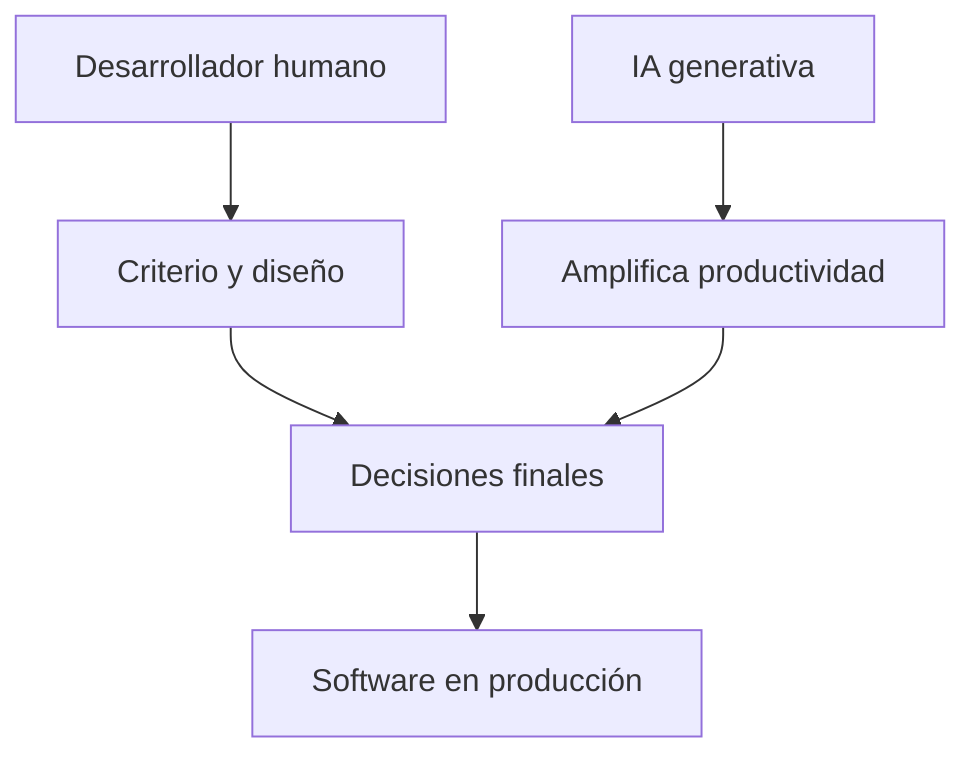

### Cuándo usar / Cuándo no

| Situación | ¿Integrar IA? |
|---|---|
| Equipo con flujos de revisión establecidos | Sí — acelera sin sacrificar calidad |
| Dominio regulado sin políticas de datos | No hasta definir gobernanza |
| Tarea mecánica repetitiva (boilerplate, tests) | Sí — alto ROI |
| Decisiones de arquitectura críticas | IA asiste; humano decide |

> **Nota del instructor:** Este capítulo no te enseña a "usar ChatGPT". Te enseña a entender **cómo se integra la IA en el flujo profesional de desarrollo de software** — qué protocolos existen, qué riesgos hay y qué decisiones arquitectónicas implica.

---

## 2. IA en el ciclo de vida del software (SDLC)

### Definición formal

El **SDLC (Software Development Life Cycle)** es el conjunto de fases por las que pasa el software desde la concepción hasta la operación y eventual retirada. La **IA generativa en el SDLC** es la asistencia automatizada en cada fase mediante modelos de lenguaje, sin transferir la responsabilidad final al modelo.

### Explicación desarrollada

La IA no vive solo en el editor de código. Afecta a todo el ciclo:

| Fase | Qué puede hacer la IA | Qué sigue siendo humano |
|---|---|---|
| **Diseño** | Borradores de ADR, exploración de alternativas, diagramas iniciales | Decisión final de arquitectura, trade-offs de negocio |
| **Implementación** | Generación de código, refactors, migraciones mecánicas | Revisión, tests, comprensión del dominio |
| **Pruebas** | Casos de prueba, mocks, análisis de cobertura | Definir qué es "correcto" desde el negocio |
| **Despliegue** | Generación de manifiestos, scripts de CI/CD, validación de configs | Aprobación de despliegues, rollback manual |
| **Operaciones** | Interpretación de logs, borradores de runbooks, correlación de alertas | Decisión de rollback, comunicación con stakeholders |
| **Documentación** | Guías, onboarding, resúmenes de cambios | Verificar exactitud, mantener actualizado |

**Ejemplos concretos por fase:**

- **Diseño:** "Genera un borrador de ADR comparando REST vs gRPC para este servicio de notificaciones" — la IA produce el borrador; el arquitecto valida trade-offs.
- **Implementación:** "Implementa el handler de CreateOrder siguiendo el patrón existente en CreateProduct" — la IA genera código; el desarrollador revisa lógica de negocio y edge cases.
- **Pruebas:** "Genera tests unitarios para OrderService cubriendo casos de stock insuficiente y pago fallido" — la IA produce tests; el QA valida que cubren requisitos reales.
- **Operaciones:** "Resume los logs de error de la última hora y sugiere causa raíz" — la IA correlaciona; el SRE decide acción.

La flecha punteada en el diagrama indica que la IA **asiste** en cada fase, no la reemplaza. El ciclo sigue siendo responsabilidad del equipo.

### Diagrama

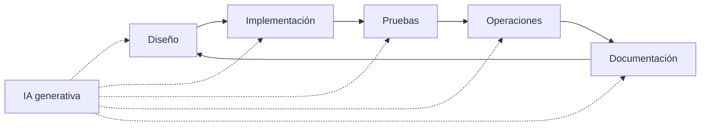

Fuente editable: [assets/diagrams/11-sdlc-ai.mermaid](./assets/diagrams/11-sdlc-ai.mermaid)

### Cuándo usar / Cuándo no

| Fase | IA recomendada para… | Evitar IA para… |
|---|---|---|
| **Diseño** | Explorar alternativas, borradores | Decisión final sin revisión |
| **Implementación** | Boilerplate, refactors mecánicos | Lógica de negocio crítica sin tests |
| **Operaciones** | Interpretar logs, borradores de runbook | Rollback automático sin aprobación |
| **Documentación** | Primer borrador, resúmenes | Documentación de compliance sin verificar |

> **Nota del instructor:** La IA es más útil en tareas **mecánicas y repetitivas** (boilerplate, tests estándar, documentación inicial) y más peligrosa en tareas que requieren **juicio de dominio** (modelado de negocio, decisiones de seguridad). Conoce la diferencia.

---

## 3. Prompt engineering — técnicas fundamentales

### Definición formal

**Prompt engineering** es el diseño cuidadoso de instrucciones, contexto, restricciones y ejemplos (few-shot) enviados a un modelo generativo para obtener respuestas precisas, consistentes y útiles **sin modificar los pesos del modelo**.

### Explicación desarrollada

Un prompt es la entrada que recibe el modelo. Su calidad determina directamente la calidad de la salida. Prompt engineering es el **primer paso** y el de **menor coste** en la personalización de comportamiento de IA — domínalo antes de saltar a RAG o fine-tuning.

**Técnicas fundamentales:**

#### Zero-shot

Instrucción directa sin ejemplos:

```
Traduce el siguiente mensaje de error de SQL Server a lenguaje claro para un usuario final:
"Violation of PRIMARY KEY constraint 'PK_Orders'..."
```

Funciona para tareas simples y bien definidas.

#### Few-shot

Incluir ejemplos del formato o comportamiento deseado:

```
Convierte nombres de variables a camelCase:
- user_id → userId
- order_total_amount → orderTotalAmount
- created_at_utc → createdAtUtc

Convierte: payment_method_type
```

Los ejemplos anclan el formato de salida.

#### Chain-of-thought (CoT)

Pedir razonamiento paso a paso antes de la respuesta final:

```
Analiza este método paso a paso e identifica posibles race conditions.
Explica tu razonamiento antes de proponer cambios.
[código]
```

Reduce errores en tareas de análisis complejo.

#### Role prompting

Asignar un rol al modelo:

```
Actúa como un revisor de código senior especializado en seguridad .NET.
Revisa el siguiente controller y lista vulnerabilidades potenciales.
```

Enmarca el tono y profundidad de la respuesta.

#### Restricciones explícitas

Definir qué NO hacer es tan importante como qué hacer:

```
Refactoriza este método para usar async/await.
Restricciones:
- No añadas dependencias NuGet nuevas
- Mantén la firma pública del método
- No cambies la lógica de negocio
```

**Buenas prácticas consolidadas:**

| Práctica | Por qué |
|---|---|
| Ser específico en la tarea | "Refactoriza para async/await" > "Mejora este código" |
| Dar contexto relevante | Lenguaje, framework, versión, restricciones |
| Pedir razonamiento paso a paso | Reduce errores en tareas complejas |
| Incluir ejemplos del formato deseado | Few-shot mejora consistencia |
| Definir qué NO hacer | Evita cambios no deseados |
| Iterar el prompt | El primer prompt raramente es el definitivo |

**Anti-patrones de prompt:**

| Anti-patrón | Problema |
|---|---|
| Prompt vago ("arregla esto") | Respuesta genérica e inútil |
| Demasiado contexto irrelevante | Confunde al modelo, consume tokens |
| No especificar formato de salida | JSON vs prosa vs lista — impredecible |
| Confiar en un solo intento | Iterar es normal y esperado |

### Diagrama

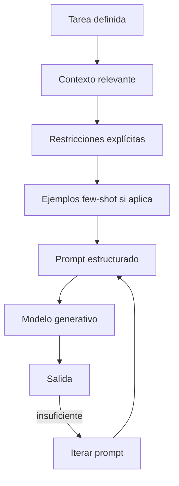

### Cuándo usar / Cuándo no

| Situación | ¿Prompt engineering? |
|---|---|
| Tareas puntuales, exploración, prototipado | Sí — siempre el primer paso |
| Formateo de salida, traducción, explicación | Sí — suficiente |
| Conocimiento interno extenso y cambiante | Insuficiente — evalúa RAG |
| Comportamiento muy especializado del dominio | Insuficiente — evalúa fine-tuning |

> **Nota del instructor:** Guarda prompts que funcionan bien en un archivo compartido del equipo (`.cursor/rules`, wiki interna). Un buen prompt reutilizable ahorra horas — es código, no conversación desechable.

---

## 4. RAG — Retrieval-Augmented Generation

### Definición formal

**RAG (Retrieval-Augmented Generation)** es una técnica donde, antes de generar una respuesta, el sistema **recupera documentos relevantes** de una base de conocimiento externa e **inyecta ese contexto** en el prompt del modelo, anclando la respuesta a información verificable.

### Explicación desarrollada

El modelo no "sabe" tu documentación interna por entrenamiento — la **lee en el momento** de responder. Esto resuelve dos problemas del modelo base:

1. **Conocimiento desactualizado:** el modelo fue entrenado meses o años atrás.
2. **Conocimiento privado:** tu wiki, ADRs, código fuente y runbooks no están en el entrenamiento.

**Pipeline RAG completo — cuatro etapas:**

#### Etapa 1: Indexación (offline)

1. **Recopilar documentos:** wiki, README, ADRs, código fuente, runbooks, specs.
2. **Chunking (fragmentación):** dividir documentos en trozos de 500–1000 tokens con solapamiento (overlap) de 50–100 tokens para no cortar contexto a mitad de párrafo.
3. **Embedding:** convertir cada chunk en un vector numérico (representación semántica) usando un modelo de embedding (OpenAI text-embedding-3, Cohere, open source).
4. **Almacenamiento:** guardar vectores en una base de datos vectorial (Pinecone, Weaviate, pgvector, Azure AI Search).

#### Etapa 2: Retrieval (online — por consulta)

1. El usuario hace una pregunta.
2. La pregunta se convierte en embedding con el **mismo modelo** usado en indexación.
3. **Búsqueda de similitud:** encontrar los K chunks más similares (top-K, típicamente 3–10).
4. Opcionalmente: búsqueda híbrida (vectorial + keyword BM25) para capturar términos exactos.

#### Etapa 3: Augmentation

1. Los chunks recuperados se insertan en el prompt como contexto.
2. El prompt incluye instrucción: "Responde basándote SOLO en el contexto proporcionado. Si no hay información suficiente, dilo."

#### Etapa 4: Generation

1. El modelo genera la respuesta anclada al contexto.
2. Idealmente incluye **citas** a las fuentes ("según ADR-007, se eligió PostgreSQL porque…").

**Chunking — decisiones críticas:**

| Estrategia | Ventaja | Desventaja |
|---|---|---|
| Por párrafo | Respeta límites semánticos | Chunks de tamaño variable |
| Por tokens fijos (512) | Tamaño uniforme | Puede cortar contexto |
| Por sección (headers markdown) | Coherencia temática | Secciones muy largas o muy cortas |
| Con overlap 10–20 % | No pierde contexto en bordes | Más chunks = más almacenamiento |

**Calidad del retrieval = calidad del RAG.** Si recuperas chunks irrelevantes, el modelo alucinará o responderá con información incorrecta aunque el prompt sea perfecto.

### Diagrama

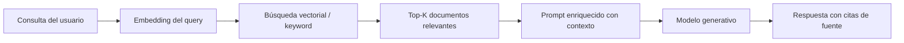

Fuente editable: [assets/diagrams/11-rag-flow.mermaid](./assets/diagrams/11-rag-flow.mermaid)

**Pipeline de indexación (complementario):**

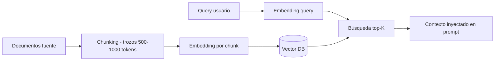

Fuente editable: [assets/diagrams/11-chunking-rag.mermaid](./assets/diagrams/11-chunking-rag.mermaid)

### Cuándo usar / Cuándo no

| Situación | ¿RAG? |
|---|---|
| Documentación interna extensa y cambiante | Sí — ideal |
| Codebases grandes donde el context window no cabe | Sí — con indexación del repo |
| Políticas de empresa, runbooks, procedimientos | Sí — trazabilidad con citas |
| Tarea puntual sin base de conocimiento | No — prompt engineering basta |
| Formato de salida muy rígido y estable | Evalúa fine-tuning además de RAG |

> **Nota del instructor:** RAG no elimina alucinaciones — las reduce. Siempre verifica la respuesta contra la fuente citada. Un RAG mal indexado (chunks incorrectos, embeddings desactualizados) es peor que un prompt directo porque da falsa confianza.

---

## 5. Fine-tuning vs RAG — cuándo elegir cada enfoque

### Definición formal

**Fine-tuning** es el reentrenamiento o adaptación (con técnicas ligeras como LoRA/QLoRA) de un modelo base con datos específicos del dominio, estilo o formato deseado, modificando los pesos internos del modelo. **RAG** mantiene el modelo intacto y le proporciona contexto externo en tiempo de consulta.

### Explicación desarrollada

Son enfoques complementarios, no excluyentes. La decisión depende de qué quieres lograr:

| Criterio | RAG | Fine-tuning |
|---|---|---|
| **Conocimiento factual actualizable** | Excelente — reindexar documentos | Malo — requiere reentrenar |
| **Formato/estilo de salida rígido** | Aceptable con prompt | Excelente — internalizado |
| **Dominio con vocabulario especializado** | Aceptable con buenos docs | Excelente — aprende el vocabulario |
| **Coste inicial** | Moderado (indexación + vector DB) | Alto (datos + GPU + pipeline) |
| **Coste por consulta** | Bajo-moderado (retrieval + tokens) | Bajo (sin retrieval) |
| **Trazabilidad de fuentes** | Sí — cita documentos | No — conocimiento opaco |
| **Datos necesarios** | Documentos de referencia | Miles de ejemplos etiquetados |
| **Tiempo de implementación** | Días-semanas | Semanas-meses |
| **Mantenimiento** | Reindexar al cambiar docs | Reentrenar con datos nuevos |

**Cuándo usar fine-tuning:**

- Formato de salida muy específico y estable (ej. siempre JSON con schema fijo).
- Dominio con vocabulario especializado (médico, legal, financiero) donde RAG no captura matices.
- Clasificación o extracción con miles de ejemplos etiquetados.
- Cuando RAG no basta porque el modelo necesita "internalizar" patrones de razonamiento del dominio.

**Cuándo NO usar fine-tuning (como junior):**

- Es poco probable que implementes fine-tuning en tu primer proyecto.
- Requiere infraestructura GPU, pipeline de evaluación, datos de calidad y gobernanza.
- Un fine-tune mal hecho es peor que el modelo base.

**Enfoque híbrido (común en producción):**

Fine-tuning ligero para estilo/formato + RAG para conocimiento factual actualizado. Lo mejor de ambos mundos con mayor complejidad operativa.

### Diagrama

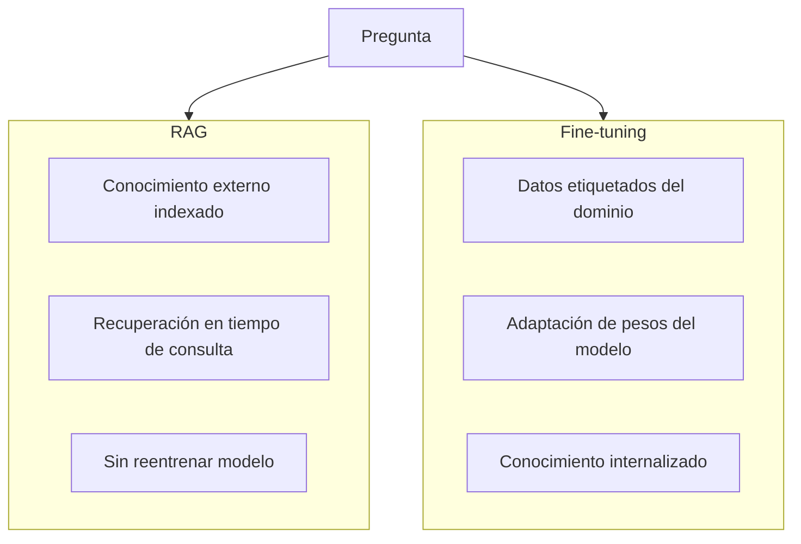

Fuente editable: [assets/diagrams/11-fine-tuning-vs-rag.mermaid](./assets/diagrams/11-fine-tuning-vs-rag.mermaid)

### Cuándo usar / Cuándo no

| Enfoque | Elige cuando… | Evita cuando… |
|---|---|---|
| **Prompt engineering** | Tareas puntuales, prototipado | Conocimiento interno extenso |
| **RAG** | Documentación interna, codebases grandes | Formato de salida muy rígido sin docs |
| **Fine-tuning** | Dominio especializado, miles de ejemplos | Datos insuficientes o sin pipeline de evaluación |
| **RAG + fine-tuning** | Producción madura con ambos requisitos | Equipo pequeño sin ops de ML |

> **Nota del instructor:** Como junior, empieza con prompt engineering, luego RAG. Fine-tuning es territorio de equipos con experiencia en ML ops. Conocer que existe y cuándo se considera es suficiente para tu etapa.

---

## 6. Agentes de IA — el bucle planificar-ejecutar-observar

### Definición formal

Un **agente de IA** es un sistema donde el modelo no responde una sola vez, sino que **planifica, ejecuta acciones en el entorno mediante herramientas (tools) e itera** hasta completar una tarea o alcanzar un límite de iteraciones.

### Explicación desarrollada

**Chat simple vs agente:**

| Aspecto | Chat simple | Agente |
|---|---|---|
| Interacción | Una respuesta por turno | Múltiples pasos con herramientas |
| Efecto en el entorno | Ninguno — solo texto | Lee archivos, ejecuta comandos, crea PRs, consulta BD |
| Riesgo | Bajo — solo genera texto | Alto — puede modificar sistemas reales |
| Supervisión | Opcional | **Obligatoria** |

**El bucle del agente (tool loop):**

1. **Objetivo:** el usuario define la tarea ("arregla el bug del endpoint de pagos").
2. **Planificación:** el modelo decide qué pasos necesita.
3. **Acción:** invoca una herramienta (leer archivo, ejecutar test, buscar en repo).
4. **Observación:** recibe el resultado de la herramienta.
5. **Replanificación:** evalúa si necesita más acciones o puede responder.
6. Repite 3–5 hasta completar o alcanzar límite de iteraciones.

Ejemplo concreto del bucle:

```
Usuario: "Arregla el bug del endpoint POST /payments"

Iteración 1: Agente → tool:read_file("PaymentsController.cs") → observa código
Iteración 2: Agente → tool:run_tests("Payments.Tests") → observa 2 tests fallando
Iteración 3: Agente → tool:read_file("PaymentService.cs") → identifica null reference
Iteración 4: Agente → tool:edit_file("PaymentService.cs") → aplica fix
Iteración 5: Agente → tool:run_tests("Payments.Tests") → 0 fallos
Iteración 6: Agente → respuesta final al usuario con resumen del fix
```

**Human-in-the-loop — acciones que SIEMPRE requieren aprobación humana:**

- Despliegues a producción.
- Eliminación de datos o recursos.
- Cambios en infraestructura (IaC apply).
- Merge de pull requests.
- Operaciones de escritura en bases de datos de producción.
- Ejecución de comandos con permisos elevados.

> **Principio:** el agente propone; el humano dispone — especialmente en acciones destructivas o irreversibles.

**Límites de seguridad del agente:**

| Control | Propósito |
|---|---|
| Max iterations | Evitar bucles infinitos |
| Tool allowlist | Solo herramientas autorizadas |
| Read-only en prod | MCP servers sin permisos de escritura |
| Sandbox de ejecución | Comandos en contenedor aislado |
| Audit log | Registro de cada acción del agente |

### Diagrama

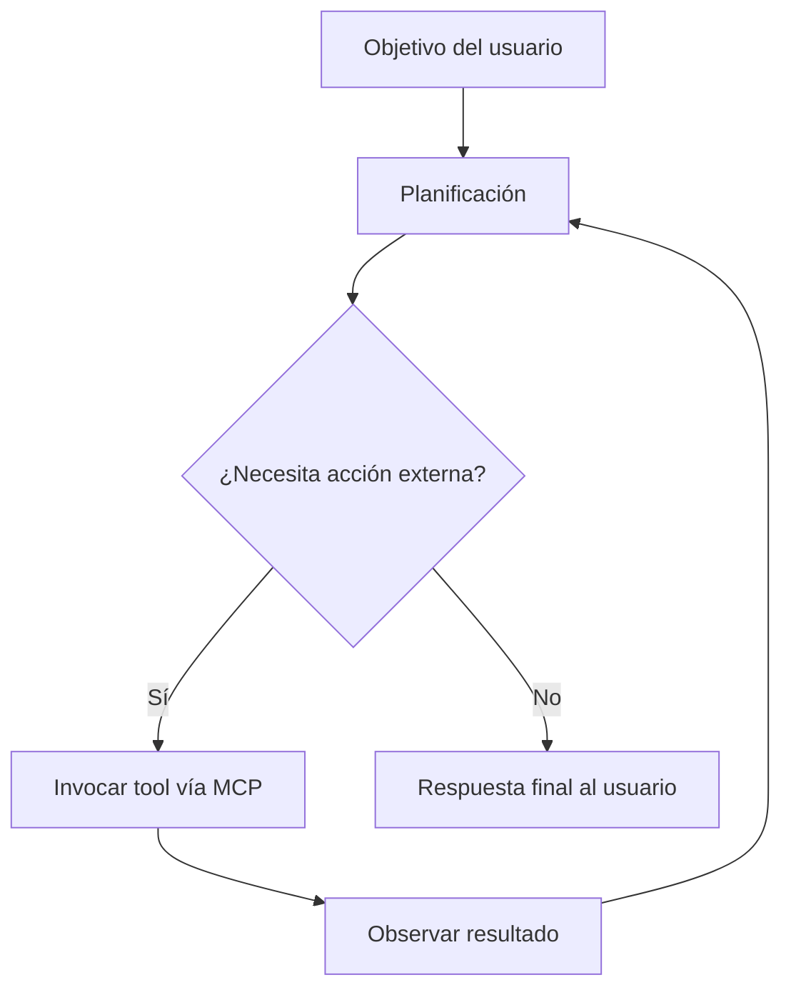

Fuente editable: [assets/diagrams/11-agent-loop.mermaid](./assets/diagrams/11-agent-loop.mermaid)

### Cuándo usar / Cuándo no

| Situación | ¿Agente autónomo? |
|---|---|
| Tarea multi-paso con herramientas (IDE, CI) | Sí — con supervisión |
| Pregunta puntual de documentación | No — chat o RAG suficiente |
| Operaciones en producción | Solo con human-in-the-loop |
| Exploración de codebase grande | Sí — con tools de lectura acotados |

> **Nota del instructor:** Un agente sin límites de iteración ni allowlist de tools es un riesgo de seguridad. Configura max iterations (10–20) y revisa qué tools tiene acceso antes de activarlo en un repo real.

---

## 7. MCP (Model Context Protocol)

### Definición formal

**MCP (Model Context Protocol)** es un protocolo abierto que estandariza cómo un **host** (IDE, aplicación de agente) se conecta a **servidores** que exponen herramientas (tools), datos legibles (resources) y plantillas (prompts) al modelo de IA.

### Explicación desarrollada

Antes de MCP, cada IDE o agente implementaba sus propias integraciones con GitHub, bases de datos, diagramas, browsers, etc. — APIs ad-hoc, duplicación de esfuerzo, silos de ecosistema. MCP define un **contrato común** reutilizable.

**Componentes de la arquitectura MCP:**

| Componente | Rol | Ejemplo |
|---|---|---|
| **MCP Host** | Aplicación que contiene el agente/modelo | Cursor, Claude Desktop, VS Code con extensión |
| **MCP Client** | Conector dentro del host que habla el protocolo MCP | Integrado en el IDE — gestiona conexiones |
| **MCP Server** | Proceso independiente que expone capacidades | Servidor GitHub, draw.io, BD read-only, browser |

**Flujo de comunicación:**

1. El Host arranca y el Client se conecta a uno o más Servers.
2. El Server anuncia sus capacidades (tools, resources, prompts disponibles).
3. Cuando el agente necesita actuar, el Client invoca un tool del Server.
4. El Server ejecuta la acción y devuelve el resultado al Client → al agente.

**Tipos de capacidades MCP:**

| Tipo | Descripción | Ejemplo |
|---|---|---|
| **Tools** | Acciones invocables por el agente | Ejecutar query SQL read-only, crear issue en GitHub, tomar screenshot, editar diagrama |
| **Resources** | Datos legibles por el agente | Contenido de un archivo, schema OpenAPI, configuración, URI de documentación |
| **Prompts** | Plantillas predefinidas reutilizables | "Revisa este PR según checklist de seguridad", "Genera ADR desde descripción" |

**Transportes habituales:**

| Transporte | Cuándo se usa |
|---|---|
| **stdio** | Servidor local lanzado como subproceso del IDE |
| **SSE (Server-Sent Events)** | Servidor remoto accesible por HTTP |
| **HTTP** | Comunicación request/response estándar |

**MCP vs plugins propietarios:**

| Aspecto | Plugin propietario | MCP |
|---|---|---|
| **Portabilidad** | Funciona solo en un IDE | Un servidor MCP funciona en cualquier host compatible |
| **Contrato** | API ad-hoc por integración | Protocolo estándar con tipos definidos |
| **Transporte** | Acoplado al host | Agnóstico: stdio, SSE, HTTP |
| **Ecosistema** | Silos | Servidores reutilizables entre herramientas |

Un servidor MCP de GitHub configurado una vez funciona en Cursor, Claude Desktop u otro host compatible — sin reimplementar la integración.

**Ejemplo draw.io MCP:**

Un servidor MCP conectado a draw.io permite al agente:

- Crear diagramas de arquitectura desde descripciones en lenguaje natural.
- Iterar visualmente ("añade un load balancer entre el gateway y los servicios").
- Exportar diagramas para documentación técnica.

Especialmente útil para juniors que aún no dominan herramientas de diagramación: describes la arquitectura, el agente genera el diagrama, tú revisas y corriges.

### Diagrama

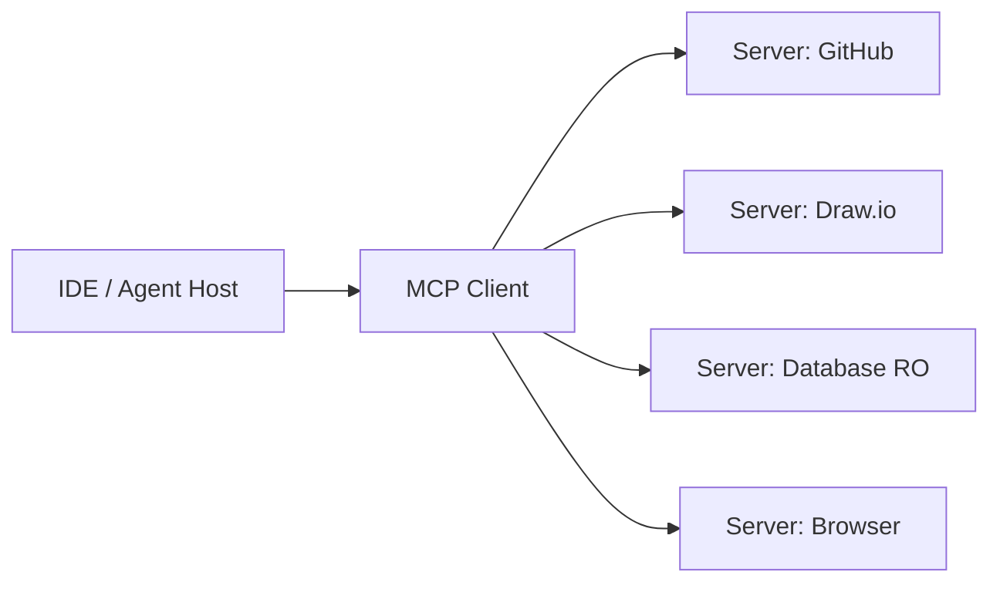

Fuente editable: [assets/diagrams/11-mcp-architecture.mermaid](./assets/diagrams/11-mcp-architecture.mermaid)

### Cuándo usar / Cuándo no

| Situación | ¿MCP? |
|---|---|
| IDE/agente que necesita acceder a tools externas | Sí — estándar emergente |
| Integración one-off sin reutilización | Plugin directo puede bastar |
| Acceso a producción | Solo servers read-only con least privilege |
| Ecosistema multi-herramienta | Sí — un server, múltiples hosts |

> **Nota del instructor:** MCP es un protocolo joven pero con adopción rápida. Aprender a configurar servidores MCP (GitHub, filesystem, draw.io) será tan habitual como configurar extensiones de IDE. Empieza con servers locales (stdio) antes de servers remotos.

---

## 8. Context window — limitaciones y estrategias

### Definición formal

El **context window** (ventana de contexto) es la cantidad máxima de tokens (unidades aproximadas de texto, ~4 caracteres en inglés, variable en español) que el modelo puede procesar en una sola conversación — incluyendo instrucciones del sistema, historial, documentos recuperados por RAG y la respuesta generada.

### Explicación desarrollada

Un repositorio de software mediano puede tener **millones de tokens**. El context window de los modelos actuales, aunque crece (8K → 128K → 1M tokens en modelos recientes), sigue siendo finito. No cabe todo el codebase en un prompt — y aunque cupiera, la calidad de atención del modelo degrada con contextos muy largos ("lost in the middle" problem).

**Composición del context window:**

```
[System prompt] + [Reglas del proyecto] + [Historial de chat] + [RAG context] + [Archivos referenciados] + [Respuesta generada] ≤ Context window
```

Cada componente consume tokens. Si RAG recupera 10 chunks de 1000 tokens, ya consumiste 10 000 tokens solo en contexto.

**Estrategias para codebases grandes:**

| Estrategia | Cómo funciona |
|---|---|
| **RAG sobre el codebase** | Indexar el repositorio; recuperar solo archivos relevantes por consulta |
| **Referencia explícita** | Indicar archivos concretos (`@archivo.cs`) en lugar de "lee todo el proyecto" |
| **Tareas divididas** | Subagentes o sesiones por área: "solo trabaja en la capa de dominio" |
| **Reglas persistentes** | Archivos de reglas (`.cursor/rules`, `AGENTS.md`) que condensan convenciones sin incluir todo el código |
| **Resúmenes arquitectónicos** | Documentos de alto nivel que orientan sin incluir implementación completa |
| **Summarization** | Comprimir historial de chat antiguo en resumen antes de continuar |

**Estimación de tokens (regla práctica):**

| Contenido | Tokens aproximados |
|---|---|
| 1 línea de código C# | 10–20 tokens |
| 1 archivo de 200 líneas | 2 000–4 000 tokens |
| README de 500 palabras | 700–1 000 tokens |
| Conversación de 10 turnos | 5 000–15 000 tokens |

Con un context window de 128K tokens, puedes incluir ~30–50 archivos medianos — no un repo completo de 500 archivos.

### Diagrama

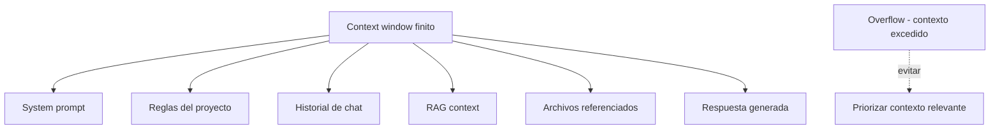

### Cuándo usar / Cuándo no

| Estrategia | Usa cuando… | Evita cuando… |
|---|---|---|
| **RAG** | Codebase grande, documentación extensa | Pregunta sobre un solo archivo |
| **Referencia explícita** | Sabes qué archivos son relevantes | No sabes dónde buscar (usa RAG) |
| **Reglas persistentes** | Convenciones estables del proyecto | Cada tarea es única |
| **Meter todo el repo en prompt** | Nunca | Siempre — calidad degrada y coste explota |

> **Nota del instructor:** No intentes meter todo el proyecto en un prompt. Orienta al agente con contexto **relevante y acotado** — es más efectivo, más barato y produce mejores resultados.

---

## 9. Seguridad y gobernanza

### Definición formal

**Gobernanza de IA** es el conjunto de políticas, controles técnicos y procesos organizacionales que regulan cómo se usa la IA generativa en el desarrollo de software, incluyendo qué datos se comparten con modelos, qué acciones pueden ejecutar agentes y quién es responsable de los outputs.

### Explicación desarrollada

Integrar IA en flujos de desarrollo introduce riesgos que no existen con un compilador tradicional:

| Riesgo | Descripción | Mitigación |
|---|---|---|
| **Exposición de secretos** | Pegar credenciales, connection strings o tokens en el prompt | Secret scanning en repos; nunca pegar secretos; variables de entorno |
| **Permisos excesivos del agente** | Agente con acceso de escritura a producción | Least privilege; MCP read-only en prod; human-in-the-loop |
| **Código vulnerable generado** | SQL injection, XSS, hardcoded secrets en código sugerido | Revisión humana obligatoria; SAST en CI; tests automatizados |
| **Fuga de propiedad intelectual** | Enviar código propietario a modelos cloud públicos | Políticas de empresa; modelos on-premise o con acuerdos de confidencialidad |
| **Alucinaciones** | El modelo inventa APIs, métodos o configuraciones que no existen | Verificar contra documentación oficial; ejecutar tests; no confiar sin validar |
| **Dependencias fantasma** | Sugerir paquetes NuGet/npm que no existen o contienen malware | Verificar existencia del paquete; usar fuentes oficiales; escaneo de dependencias |
| **Sesgo en datos de entrenamiento** | Outputs que reflejan sesgos del modelo base | Revisión humana; tests de fairness; diversidad en datos de fine-tuning |
| **Prompt injection** | Input malicioso que manipula el comportamiento del agente | Sanitizar inputs; separar instrucciones de datos; allowlist de tools |

**Principios de gobernanza:**

1. **La IA propone; el humano dispone** — especialmente en producción.
2. **Least privilege** — el agente accede solo a lo que necesita para la tarea.
3. **Todo código generado pasa por el mismo pipeline** — review, tests, SAST, como cualquier PR humano.
4. **Políticas claras del equipo** — qué datos se pueden enviar a modelos cloud y cuáles no.
5. **Audit trail** — registro de prompts, tools invocados y outputs en entornos sensibles.
6. **Modelo apropiado para la tarea** — no enviar PII a modelos públicos; usar modelos enterprise con DPA.

**Clasificación de datos para IA:**

| Clasificación | ¿Enviar a modelo cloud público? | Alternativa |
|---|---|---|
| Código open source | Sí | — |
| Código propietario | Según política de empresa | Modelo enterprise / on-premise |
| Datos personales (PII) | No | Anonimizar o no enviar |
| Secretos / credenciales | Nunca | Secret scanning + bloqueo |
| Datos de clientes | No sin DPA | Modelo con acuerdo de confidencialidad |

### Diagrama

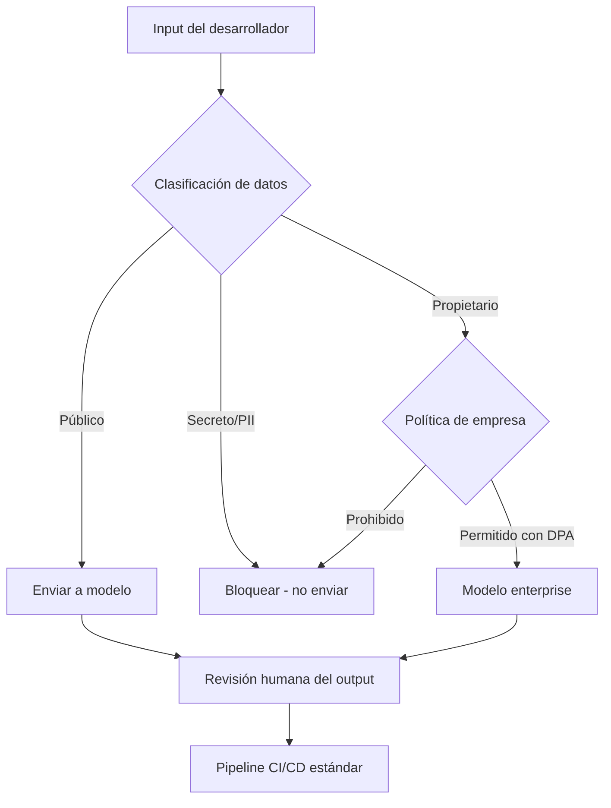

### Cuándo usar / Cuándo no

| Control | Siempre en… | Puede relajarse en… |
|---|---|---|
| **Revisión humana de código generado** | Todo código que llega a producción | Prototipos desechables locales |
| **Secret scanning** | Repos con acceso a IA | Nunca desactivar |
| **Least privilege en agentes** | Cualquier agente con tools | Chat sin tools |
| **Política de datos escrita** | Equipos de 2+ personas | Solo si eres solo dev sin datos sensibles |

> **Nota del instructor:** La gobernanza no es burocracia — es protección. Un prompt con un connection string de producción filtrado a un modelo cloud es un incidente de seguridad. Configura secret scanning **antes** de conectar IA al repo.

---

## 10. AIOps — IA en operaciones

### Definición formal

**AIOps (Artificial Intelligence for IT Operations)** es la aplicación de machine learning e IA generativa a tareas de operaciones de IT: correlación de alertas, detección de anomalías, sugerencia de causa raíz, generación de runbooks y automatización de respuesta a incidentes.

### Explicación desarrollada

La IA también asiste en operaciones — complementando la observabilidad del capítulo 09, no reemplazándola:

| Aplicación | Ejemplo concreto |
|---|---|
| **Correlación de alertas** | Agrupar 50 alertas de pods en un incidente raíz: "AZ-2 degradada" |
| **Detección de anomalías** | Identificar p99 de latencia fuera de baseline sin umbral fijo |
| **Sugerencia de causa raíz** | "El pico de latencia coincide con despliegue v2.3 hace 12 minutos" |
| **Generación de runbooks** | Borrador de pasos de remediación basado en incidentes pasados similares |
| **Consulta en lenguaje natural** | "¿Cuántos errores 500 tuvo payments-api en la última hora?" → query generada |
| **Automatización de respuesta** | Escalar, reiniciar pods, rollback — **siempre con aprobación humana** |

**AIOps vs observabilidad tradicional:**

| Aspecto | Observabilidad (cap. 09) | AIOps |
|---|---|---|
| Datos | Métricas, logs, trazas raw | Interpretación y correlación de señales |
| Consultas | PromQL, LogQL, manual | Lenguaje natural + sugerencias automáticas |
| Alertas | Umbrales y SLO-based | Anomalías + correlación inteligente |
| Respuesta | Manual con runbooks | Sugerida o semi-automatizada |

**Limitaciones de AIOps:**

- Sin observabilidad (métricas, logs, trazas), AIOps opera a ciegas — "garbage in, garbage out".
- Los modelos pueden sugerir causas raíz incorrectas — validar siempre con datos.
- Automatización de respuesta sin human-in-the-loop es riesgosa en producción crítica.

### Diagrama

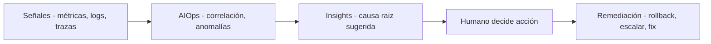

### Cuándo usar / Cuándo no

| Situación | ¿AIOps? |
|---|---|
| Alto volumen de alertas (> 100/día) | Sí — correlación esencial |
| Equipo SRE con observabilidad madura | Sí — acelera MTTR |
| Sin observabilidad implementada | No — primero capítulo 09 |
| Automatización de respuesta | Solo con aprobación humana y blast radius limitado |

> **Nota del instructor:** AIOps acelera la **interpretación** de señales de observabilidad. Pero las métricas, logs y trazas siguen siendo la fuente de verdad. Sin observabilidad, la IA opera a ciegas.

---

## 11. Diagramas asistidos por IA — draw.io MCP

### Definición formal

La **diagramación asistida por IA** es el uso de agentes con herramientas de diagramación (como servidores MCP conectados a draw.io) para generar, modificar y exportar diagramas técnicos a partir de descripciones en lenguaje natural.

### Explicación desarrollada

Un caso de uso concreto de MCP: servidores de diagramación conectados al agente permiten:

- Generar diagramas de arquitectura desde descripciones ("monolito con BD PostgreSQL y cache Redis").
- Iterar visualmente ("añade un load balancer entre el gateway y los servicios").
- Convertir código en diagramas de secuencia o componentes.
- Integrar diagramas en documentación técnica (ADRs, wikis) de forma colaborativa humano-IA.

**Flujo típico con draw.io MCP:**

1. Describir la arquitectura en lenguaje natural al agente.
2. El agente invoca el tool MCP de draw.io para crear el diagrama.
3. El diagrama se renderiza en el panel del IDE o en draw.io desktop.
4. El desarrollador revisa, corrige con instrucciones adicionales ("mueve la BD a la derecha").
5. Exportar a PNG/SVG para documentación.

**Ventajas para juniors:**

- Reduce la barrera de entrada a herramientas de diagramación.
- Permite iterar rápidamente en design sessions.
- Los diagramas sirven como artefacto de comunicación con el equipo.

**Limitaciones:**

- El agente puede simplificar en exceso o omitir componentes críticos.
- Diagramas generados requieren revisión humana antes de usarse en documentación oficial.
- La calidad depende de la precisión de la descripción en lenguaje natural.

### Diagrama

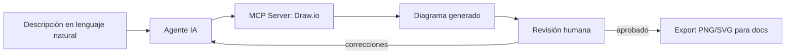

### Cuándo usar / Cuándo no

| Situación | ¿Diagramas asistidos por IA? |
|---|---|
| Borrador rápido de arquitectura en design session | Sí |
| Diagrama oficial para ADR o documentación de compliance | Generar borrador con IA; revisar y aprobar manualmente |
| Diagrama con notación estricta (UML formal) | Revisar notación cuidadosamente |
| Exploración de alternativas arquitectónicas | Sí — iterar es barato |

> **Nota del instructor:** Los diagramas generados por IA son **borradores**, no artefactos finales. Revisa que reflejen la realidad del sistema — un diagrama bonito pero incorrecto es peor que ninguno.

---

## 12. El futuro inmediato — qué esperar como junior

### Definición formal

El **panorama de integración IA en desarrollo de software** evoluciona hacia protocolos estándar (MCP), agentes con herramientas acotadas, RAG sobre repositorios internos y gobernanza formal — transformando el rol del desarrollador de "escribir todo el código" a "dirigir, revisar y validar".

### Explicación desarrollada

| Tendencia | Implicación para ti |
|---|---|
| MCP como estándar de integración | Aprender a configurar servidores MCP será tan habitual como configurar extensiones de IDE |
| Agentes en CI/CD | Pipelines que incluyen revisión automatizada, generación de tests, análisis de impacto |
| RAG sobre repos internos | Documentación viva que responde preguntas sobre el codebase |
| Regulación y gobernanza | Políticas de empresa sobre uso de IA cada vez más formales |
| Modelos más capaces, context windows mayores | Menos limitación técnica, más responsabilidad en criterio humano |

Lo que **no** cambia:

- Necesitas entender arquitectura, dominio, patrones, observabilidad y resiliencia.
- La IA acelera la ejecución; **tú** sigues siendo responsable del diseño y la calidad.
- La revisión humana no es opcional — es la última línea de defensa.
- Los fundamentos de ingeniería de software (SOLID, patrones, testing, operaciones) son más importantes, no menos.

### Diagrama

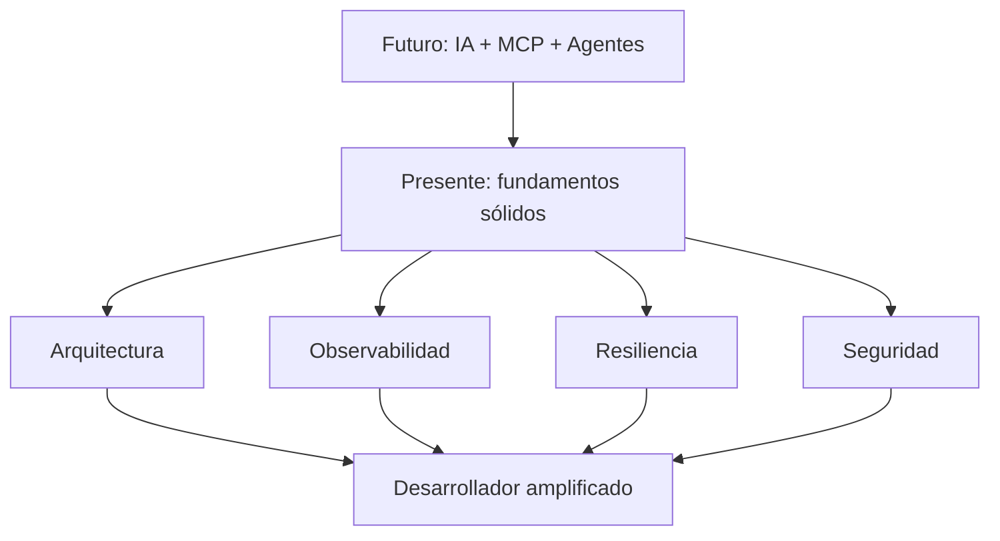

### Cuándo usar / Cuándo no

| Inversión de aprendizaje | Prioridad | Por qué |
|---|---|---|
| Fundamentos (arquitectura, patrones, ops) | Alta — siempre | La IA no los sustituye |
| Prompt engineering | Alta — ahora | Bajo coste, alto impacto inmediato |
| RAG y MCP | Media — próximos meses | Estándar emergente |
| Fine-tuning | Baja — como junior | Requiere equipo ML maduro |

> **Nota del instructor:** No persigas cada novedad de IA. Domina los capítulos 01–10 de esta guía **y** usa IA como acelerador. Un junior que entiende circuit breakers y sabe pedirle a la IA que genere tests es infinitamente más valioso que uno que solo sabe chatear con un bot.

---

## Resumen del capítulo

- La IA generativa es una **capa de productividad** en todo el ciclo de vida del software; no sustituye criterio, diseño ni revisión humana.
- **Prompt engineering** es el primer paso (zero-shot, few-shot, chain-of-thought, restricciones); bajo coste, alto impacto.
- **RAG** ancla respuestas a documentación actualizada mediante embedding, chunking, retrieval y generación con citas.
- **Fine-tuning** adapta el modelo a dominios especializados; más costoso que RAG; evaluar según tabla comparativa.
- Los **agentes** planifican y ejecutan acciones multi-paso via tools; requieren **supervisión**, allowlist y human-in-the-loop.
- **MCP** estandariza la conexión host ↔ client ↔ server con tools, resources y prompts; draw.io MCP para diagramas.
- El **context window** es finito; usa RAG, referencias explícitas y tareas acotadas para codebases grandes.
- **Seguridad y gobernanza** son obligatorias: least privilege, revisión humana, SAST, políticas de datos, secret scanning.
- **AIOps** complementa observabilidad con correlación y sugerencias; no reemplaza métricas, logs ni trazas.
- Domina fundamentos primero; usa IA como acelerador, no como muleta.

**Siguiente paso:** lee el capítulo 12 — la síntesis que conecta todos los temas de la guía en un hilo conductor pedagógico, desde el dominio de negocio hasta la operación en producción con IA.
