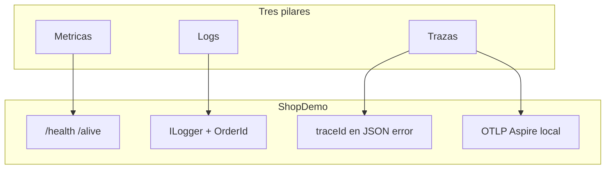
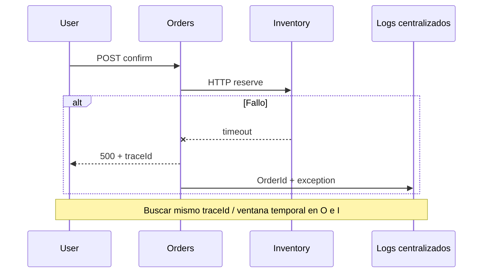
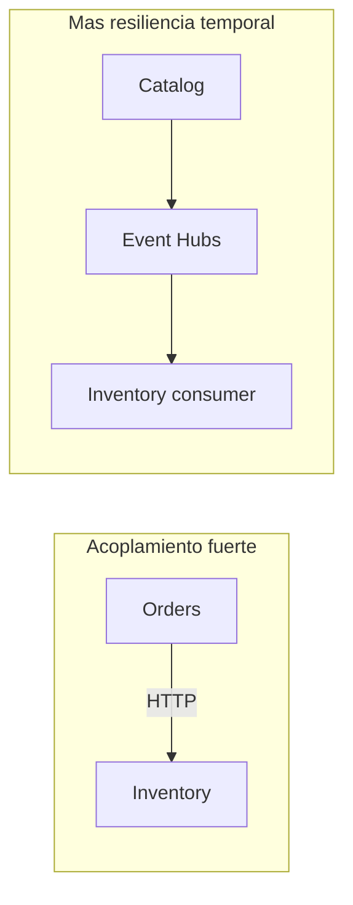

# 11 — Observabilidad y resiliencia

**Objetivo:** Dominar los tres pilares de observabilidad y los patrones de resiliencia **como están implementados en ShopDemo**, con respuestas listas para entrevista SRE / backend senior.

**Tiempo orientativo:** 55 min.

---

## 1. Observabilidad vs monitorización

| Concepto | Definición corta | Entrevista |
|---|---|---|
| **Monitorización** | ¿Está vivo? ¿Supera umbral? | Health checks, alertas CPU |
| **Observabilidad** | ¿Por qué falló? ¿Qué pasó internamente? | Logs correlacionados, trazas, métricas de negocio |

**Respuesta modelo:** *Monitorización detecta síntomas; observabilidad permite **inferir estado interno** sin redeploy. En ShopDemo empezamos con health + logs + `traceId`; OpenTelemetry completa el cuadro en Aspire/Analytics.*

---

## 2. Los tres pilares (en ShopDemo)



Fuente draw.io: [assets/diagrams/09-observabilidad-resiliencia.mermaid](./assets/diagrams/09-observabilidad-resiliencia.mermaid)

| Pilar | Pregunta | Implementación ShopDemo |
|---|---|---|
| **Métricas** | ¿Cuánto / qué tasa? | CPU HPA Catalog, métricas contenedor ACA/ECS/EKS, Event Hubs *Incoming Messages* |
| **Logs** | ¿Qué ocurrió? | `ILogger<T>` estructurado; `InventoryHttpClient` con `{OrderId}` |
| **Trazas** | ¿Qué servicios participaron? | `context.TraceIdentifier` en Problem Details; OTLP en Analytics/Aspire |

**Código clave:**

```text
Catalog/ShopDemo.Catalog.Api/Middleware/ExceptionHandlingMiddleware.cs  → traceId
Aspire/ShopDemo.ServiceDefaults/Extensions.cs                           → OTEL + resilience
Inventory/.../InventoryHttpClient.cs                                    → logs de integración
```

---

## 3. Health checks: `/health` vs `/alive`

| Endpoint | Rol K8s | Comportamiento |
|---|---|---|
| **`/health`** | **Readiness** | ¿Puede recibir tráfico? (DB, dependencias listas) |
| **`/alive`** | **Liveness** | ¿El proceso responde? Si no → **restart** del pod |

**En manifiestos:** `k8s/{local,azure,aws}/*/deployment.yaml` — probes HTTP.

**Entrevista — trampa:** Confundir liveness con readiness. Un pod *live* pero *not ready* no recibe tráfico pero **no se reinicia** (útil durante arranque lento de PostgreSQL).

**Postman / Ingress:** `GET /catalog/health`, `GET /orders/alive`, etc.

---

## 4. Correlación e investigación de incidentes



Fuente: [assets/diagrams/10-incidente-investigacion.mermaid](./assets/diagrams/10-incidente-investigacion.mermaid)

**Playbook ShopDemo (confirmar pedido falla):**

1. Copiar `traceId` del JSON de error (Catalog/Orders/Inventory middleware).
2. Buscar en **Log Analytics** (Azure) o **CloudWatch Logs** (AWS) en Orders e Inventory ±1 min.
3. `kubectl get pods -n shopdemo` / consola ACA — ¿Inventory Running?
4. `curl` directo a Inventory `/health` (Ingress o DNS interno).
5. Revisar métricas: reinicios, CPU, latencia ALB/Ingress.

---

## 5. Agregación de logs por plataforma

| Entorno | Destino | Comando / ruta típica |
|---|---|---|
| **ACA / AKS** | Log Analytics | Azure Portal → workspace del lab |
| **ECS / EKS** | CloudWatch Logs | `/ecs/shopdemo-*` |
| **Minikube** | `kubectl logs` | `kubectl logs -n shopdemo deployment/shopdemo-orders` |

**Entrevista:** *¿Por qué agregar logs si ya puedo `kubectl logs`?*

**Respuesta:** En producción hay decenas de pods efímeros; sin agregación no hay búsqueda cross-service ni retención cuando el pod muere.

---

## 6. OpenTelemetry y Aspire (local)

`ShopDemo.ServiceDefaults` registra:

- OpenTelemetry (métricas, trazas, logs)
- `AddStandardResilienceHandler()` en HttpClient (Analytics)
- Health en `/health` y `/alive`

**Aspire Dashboard:** visualización local OTLP al ejecutar AppHost — ideal para **demostrar trazas** en entrevista sin cloud.

**En nube (lab):** Application Insights (Azure) y X-Ray (AWS) están documentados en guías de implementación; no todos están cableados en cada API legacy del curso.

---

## 7. Resiliencia — definición y patrones

**Resiliencia:** seguir operando o **degradar controladamente** ante fallos parciales.

| Patrón | ShopDemo | Estado |
|---|---|---|
| **Retry** | ServiceDefaults → Analytics HttpClient | Parcial |
| **Timeout** | HttpClient / plataforma | Implícito |
| **Circuit breaker** | ServiceDefaults (plantilla) | Orders→Inventory **sin CB aún** |
| **Bulkhead** | — | Fuera de alcance lab |
| **Health + reinicio** | Probes K8s / ACA | Implementado |
| **Réplicas + HPA** | Catalog HPA 1–3 @ 70% CPU | Implementado |
| **Mensajería async** | Event Hubs | Reduce acoplamiento Catalog→Inventory |



---

## 8. HPA en Catalog (entrevista DevOps)

Manifiesto: `k8s/catalog/hpa.yaml`

| Campo | Valor lab | Significado |
|---|---|---|
| `minReplicas` | 1 | Costo mínimo |
| `maxReplicas` | 3 | Techo demo |
| `targetCPUUtilization` | 70% | Escala si CPU media supera 70% |

**Requisito:** **metrics-server** en cluster (`kubectl top pods`).

**Pregunta típica:** *¿HPA escala por memoria?* — Sí, se puede añadir métrica `memory`; ShopDemo solo CPU en el lab.

---

## 9. Mapa Azure vs AWS (observabilidad)

| Capacidad | Azure | AWS |
|---|---|---|
| Logs agregados | Log Analytics | CloudWatch Logs |
| Métricas contenedor | ACA metrics / Container Insights | ECS/EKS metrics |
| APM / trazas | Application Insights | X-Ray |
| Alertas | Azure Monitor Alerts | CloudWatch Alarms |
| Consulta ejemplo | KQL en Log Analytics | Logs Insights |

---

## 10. Mapa Azure vs AWS (resiliencia)

| Mecanismo | Azure | AWS | ShopDemo |
|---|---|---|---|
| Multi-réplica | ACA min/max | ECS desired count | K8s `replicas` + HPA |
| Reinicio | K8s liveness / ACA | ECS task replace | Probes en YAML |
| Balanceo | Ingress / ACA ingress | ALB | Ingress NGINX |
| Desacople async | Event Hubs | Event Hubs (cross-cloud) | Mismo hub Azure |

---

## 11. Fortalezas y huecos (honestidad en entrevista)

Candidato senior **reconoce límites** del lab:

| Fortaleza | Hueco documentado | Mitigación real |
|---|---|---|
| Health en todas las APIs | Sin retry Orders→Inventory | Réplicas + alertas; Polly futuro |
| HPA demo Catalog | Postgres single-node en lab | BD managed + backup en prod |
| Event Hubs fan-out | Analytics solo en memoria | Persistencia / stream en prod |
| traceId en errores | Trazas distribuidas incompletas en nube | App Insights / OTEL export |

**Frase entrevista:** *“El lab prioriza enseñar probes, HPA y correlación básica; en producción añadiría retry con jitter, circuit breaker, dead-letter en Event Hubs y SLOs con error budget.”*

---

## 12. SLO, SLI y alertas (concepto)

| Término | Ejemplo ShopDemo |
|---|---|
| **SLI** | % de `POST /api/orders` confirmados con 2xx |
| **SLO** | 99% éxito en 30 días |
| **Alerta** | 5xx Orders > 5% en 5 min → página on-call |

El lab no define SLO formales; las **preguntas de entrevista** sí. Relaciona SLI con `/health` y logs de error.

---

## 13. Preguntas de entrevista (autoevaluación)

1. ¿Diferencia observabilidad y monitorización?
2. ¿Qué devuelve `/alive` que no deba devolver `/health`?
3. ¿Cómo investigarías un 500 en confirmación de pedido?
4. ¿Por qué Event Hubs mejora resiliencia frente a solo HTTP?
5. ¿Qué métrica dispara el HPA de Catalog?
6. ¿Dónde verías logs de ECS vs AKS?
7. ¿Qué es un `traceId` y dónde lo encuentra el cliente?
8. ¿Retry vs circuit breaker — cuándo cada uno?

---

## 14. Ejercicio práctico (15 min)

1. Provoca un fallo: detén Inventory (`kubectl scale deployment shopdemo-inventory --replicas=0 -n shopdemo`).
2. Confirma un pedido desde Postman.
3. Captura el `traceId` del error.
4. Busca logs de Orders (`kubectl logs` o CloudWatch).
5. Restaura Inventory y verifica `/health`.
6. Explica en voz alta qué patrón de resiliencia **faltó** (retry/CB) y qué **sí funcionó** (readiness quitando tráfico a Inventory caído).

---

## Profundizar

| Documento | Contenido |
|---|---|
| [TEORIA-OBSERVABILIDAD.md](../observabilidad/TEORIA-OBSERVABILIDAD.md) | Pilares ampliados |
| [TEORIA-RESILIENCIA.md](../resiliencia/TEORIA-RESILIENCIA.md) | Patrones nube |
| [IMPLEMENTACION-RESILIENCIA-AZURE.md](../resiliencia/azure/IMPLEMENTACION-RESILIENCIA-AZURE.md) | Lab Azure |
| [IMPLEMENTACION-RESILIENCIA-AWS.md](../resiliencia/aws/IMPLEMENTACION-RESILIENCIA-AWS.md) | Lab AWS |
| [TEORIA-KUBERNETES-OPERACIONES.md](../despliegue/kubernetes/TEORIA-KUBERNETES-OPERACIONES.md) | Probes, HPA |

**Siguiente:** [10-preguntas-entrevista.md](./10-preguntas-entrevista.md) (incluye preguntas de este capítulo).
