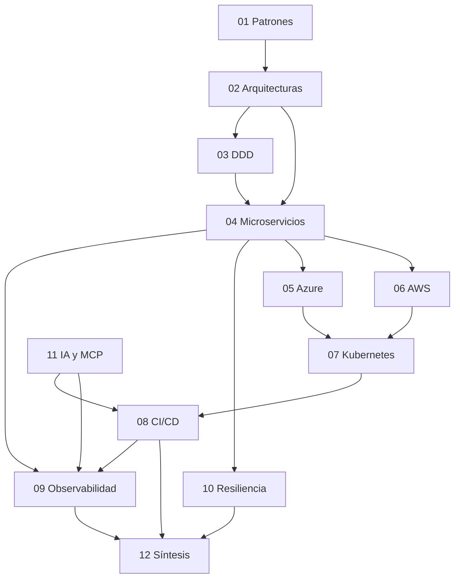
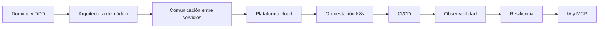
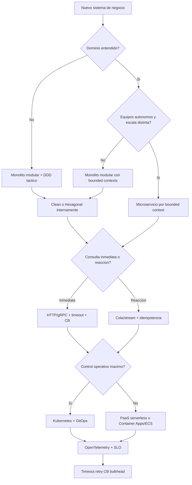
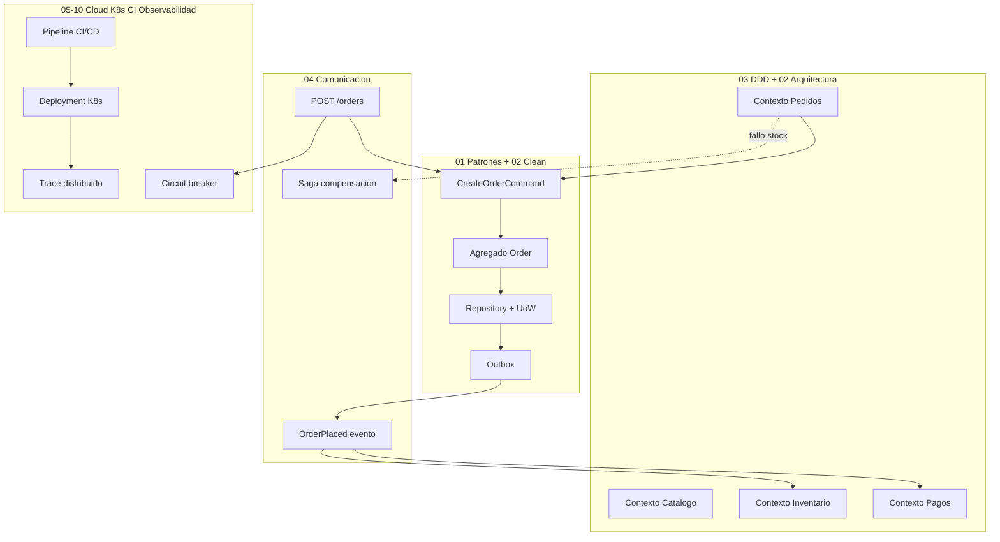
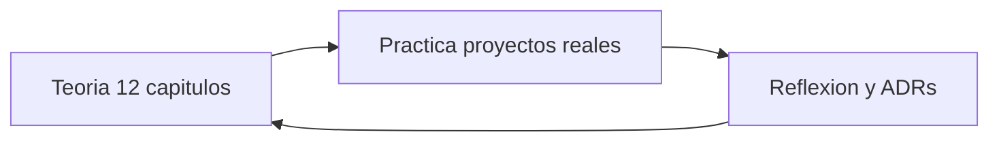

# 12 — Síntesis e integración de conceptos

## Objetivo de este capítulo

Al terminar de leer este capítulo deberías poder:

- Ver cómo los once capítulos anteriores forman una **cadena de decisiones** coherente, no una lista de tecnologías aisladas.
- Seguir el hilo conductor desde el **modelado del dominio** hasta la **operación en producción con IA**, entendiendo qué decisión habilita la siguiente.
- Reconocer los **errores sistémicos** más frecuentes en equipos junior y qué capítulos los previenen.
- Tener un **mapa mental** para orientarte cuando te enfrentes a un proyecto real: qué leer, qué decidir y en qué orden.
- Recorrer un **ejemplo completo** — un sistema de pedidos — decisión por decisión, citando capítulos concretos en cada paso.

Asumimos que has leído (o al menos hojeado) los capítulos 01–11. Este capítulo **no introduce conceptos nuevos**: conecta los que ya conoces. Si algo suena abstracto, vuelve al capítulo indicado antes de memorizar tablas.

> **Nota del instructor:** Este capítulo es el **viaje de vuelta al mapa completo** — como subir a una colina y ver el valle entero. Si los capítulos 01–11 fueron las piezas del puzzle, aquí ves la imagen completa. Léelo con calma, idealmente después de haber recorrido al menos los capítulos 01, 02, 03, 04, 09 y 10.

> **Cómo leer este capítulo:** cada sección sigue el mismo espíritu que el resto de la guía: contexto → definición → explicación → diagrama → cuándo aplicarlo. Las tablas son **brújulas de decisión**, no listas para memorizar de un tirón.

---

## 1. Por qué necesitas una síntesis

Cuando estudiaste cada capítulo por separado, aprendiste vocabulario y patrones concretos: qué es un Repository, qué es un circuit breaker, qué es un Deployment de Kubernetes. Eso es necesario, pero insuficiente.

En un proyecto real, nadie te dice: "Implementa el patrón Strategy del capítulo 01." Te dicen: "Necesitamos un sistema de pedidos online que aguante Black Friday." Y de repente debes decidir:

- ¿Monolito o microservicios?
- ¿Qué bounded contexts existen?
- ¿Cómo se comunican los servicios?
- ¿Dónde se despliega?
- ¿Cómo se observa y qué pasa cuando algo falla?

### Definición formal

La **síntesis arquitectónica** es el proceso de **relacionar decisiones técnicas** (estructura de código, comunicación, infraestructura, operación) de forma que cada elección **habilite o restrinja** las siguientes, manteniendo coherencia con el dominio de negocio.

### Explicación desarrollada

Piensa en construir una casa: no eliges el color del tejado antes de saber si el suelo aguanta dos plantas. En software, el orden importa:

1. Entender **qué** construyes (dominio).
2. Decidir **cómo organizas** el código (arquitectura + patrones).
3. Decidir **cómo se reparte** en procesos (monolito vs microservicios).
4. Decidir **dónde corre** (cloud, K8s, PaaS).
5. Decidir **cómo llega** el código a producción (CI/CD).
6. Decidir **cómo lo vigilas y proteges** (observabilidad + resiliencia).

La síntesis te enseña a **encadenar decisiones**, no a recitar definiciones.

### Cuándo volver a este capítulo

| Momento | Por qué |
|---|---|
| Antes de diseñar un sistema nuevo | Ordenar preguntas antes de elegir tecnología |
| Cuando el equipo debate "microservicios sí/no" | Conectar capítulos 02, 03 y 04 |
| Tras un incidente en producción | Ver qué capítulo faltó (09, 10, 08…) |
| Al terminar la guía | Consolidar el mapa mental |

---

## 2. Mapa de dependencias entre capítulos

Ningún capítulo vive aislado. Este diagrama muestra cómo se alimentan entre sí:



Fuente editable: [assets/diagrams/12-chapter-map.mermaid](./assets/diagrams/12-chapter-map.mermaid)

### Definición formal

Un **mapa de dependencias pedagógicas** indica qué conocimientos son **prerrequisito** de otros: no implica orden de lectura rígido, sino **relaciones conceptuales**.

### Explicación desarrollada

**Cómo leer este mapa:**

- **01 Patrones** y **02 Arquitecturas** son la base de cómo organizas código.
- **03 DDD** te enseña a modelar el negocio; condiciona si divides en microservicios (**04**).
- **04 Microservicios** abre la puerta a cloud (**05**, **06**), orquestación (**07**), CI/CD (**08**), observabilidad (**09**) y resiliencia (**10**).
- **11 IA y MCP** transversalmente acelera desarrollo (**08**) y operaciones (**09**).
- **12 Síntesis** (este capítulo) conecta todo.

**Lecturas mínimas recomendadas antes de la síntesis profunda:**

| Si solo tienes tiempo para… | Lee al menos |
|---|---|
| 3 capítulos | 02, 03, 04 |
| 6 capítulos | 01, 02, 03, 04, 09, 10 |
| Operaciones / release | 07, 08, 09, 10 además de 05 o 06 |

### Cuándo usar el mapa

- Al planificar formación en equipo: qué capítulo enseña antes de desplegar a K8s.
- Cuando alguien propone una herramienta sin contexto ("usemos Kafka") — localiza el capítulo 04 y la necesidad real.

---

## 3. El hilo conductor: siete etapas de dominio a producción

Imagina que tu equipo recibe el encargo de construir una plataforma de comercio online. No importa el lenguaje ni la nube — el **orden de pensamiento** es el mismo. Vamos etapa por etapa.



Fuente editable: [assets/diagrams/12-journey-production.mermaid](./assets/diagrams/12-journey-production.mermaid)

Cada etapa responde una pregunta distinta. Saltarte una — por ejemplo desplegar sin observabilidad — no impide el deploy, pero **multiplica el coste** de cada incidente posterior.

---

### Etapa 1: Modelar el negocio (capítulo 03 — DDD)

Todo comienza con el **dominio** — el negocio que el software representa: productos, pedidos, pagos, inventario, envíos.

#### Definición formal

**Domain-Driven Design (DDD)** es un enfoque de diseño de software que centra el desarrollo en un **modelo de dominio** profundo, con lenguaje compartido entre expertos de negocio y desarrolladores, y límites explícitos entre subdominios (**bounded contexts**).

#### Explicación desarrollada

**DDD estratégico** identifica **bounded contexts**: áreas del negocio con vocabulario y reglas propias. "Producto" en catálogo (descripción, precio, categorías) no es lo mismo que "Producto" en inventario (stock, almacén, reservas).

**DDD táctico** modela dentro de cada contexto:

| Concepto | Rol |
|---|---|
| **Agregado** | Grupo de entidades con raíz que garantiza consistencia |
| **Value Object** | Inmutable, sin identidad propia (dinero, dirección) |
| **Domain Event** | Algo ocurrió: `OrderPlaced`, `PaymentConfirmed` |
| **Repository** | Persistencia orientada a agregados (capítulo 01) |

**Decisión clave que condiciona todo lo demás:**

> ¿Monolito modular o microservicios? (capítulo 02)

| Situación | Recomendación |
|---|---|
| Dominio inmaduro, equipo pequeño (< 8 personas) | **Monolito modular** con límites claros entre módulos |
| Equipos independientes, escalado diferenciado, dominio estable | **Un microservicio por bounded context** |
| "Queremos microservicios porque suena moderno" | **No** — es el error más caro de la industria |

El dominio maduro **precede** la distribución. Dividir un dominio que aún no entiendes multiplica la confusión (capítulos 02 y 04: *distributed monolith*).

#### Cuándo profundizar en DDD antes de codificar

- Reglas de negocio **complejas** o en conflicto entre departamentos.
- Vocabulario distinto según área (ventas vs logística vs finanzas).
- Necesitas event storming o workshops con negocio.

---

### Etapa 2: Estructurar el código (capítulos 01 y 02)

Dentro de cada contexto — ya sea módulo de monolito o microservicio — necesitas organización interna.

#### Definición formal

**Clean Architecture** e **Hexagonal Architecture** organizan el código en capas o puertos/adaptadores donde las **dependencias apuntan hacia el dominio**, no hacia frameworks o bases de datos.

#### Explicación desarrollada

**Clean Architecture** y **Hexagonal** invierten las dependencias hacia el **dominio**: la lógica de negocio no conoce Entity Framework, HTTP ni colas. Los detalles técnicos son "adaptadores" intercambiables (capítulo 02).

**Patrones del capítulo 01** entran aquí con roles concretos:

| Patrón | Rol en la arquitectura |
|---|---|
| **Repository** | Abstrae persistencia del dominio |
| **Unit of Work** | Agrupa cambios en una transacción |
| **CQRS + Mediator** | Separa comandos (escritura) de queries (lectura) |
| **Outbox** | Publica eventos de forma confiable junto con la transacción |
| **Strategy** | Reglas intercambiables (descuentos, impuestos) |
| **State** | Transiciones de pedido, pago, envío |
| **Adapter / ACL** | Integración con legacy o terceros sin contaminar dominio |
| **Saga** | Coordina operaciones multi-servicio con compensación |

**Regla del instructor:** No uses todos los patrones en un CRUD simple. Usa los que resuelven un problema que **tienes**, no uno que **imaginas**.

Cuando un contexto se comunica con otro o con sistemas externos, entran los **patrones de integración**: Anti-Corruption Layer, Saga, Outbox.

#### Cuándo elegir Clean vs Hexagonal

| Preferencia del equipo | Orientación |
|---|---|
| Capas anidadas explícitas (Domain, Application, Infrastructure) | Clean |
| Énfasis en puertos explícitos y tests con adaptadores falsos | Hexagonal |
| Proyecto pequeño con dominio claro | Monolito modular + una de las dos — no ambas mezcladas sin criterio |

---

### Etapa 3: Comunicar servicios (capítulo 04)

Si elegiste microservicios, los contextos viven en procesos separados. Deben hablarse.

#### Definición formal

La **comunicación entre servicios** abarca protocolos síncronos (HTTP, gRPC) y asíncronos (colas, streaming), con garantías de entrega, idempotencia y estrategias de consistencia distribuida.

#### Explicación desarrollada

| Necesidad | Mecanismo | Capítulo |
|---|---|---|
| Respuesta inmediata ("¿hay stock?") | HTTP/gRPC síncrono | 04 |
| Desacoplamiento ("pedido creado" → notificar, actualizar inventario) | Cola o streaming asíncrono | 04 |
| Consistencia en operación multi-servicio | Saga (orquestada o coreografiada) | 01, 04 |
| Publicación confiable de eventos | Outbox pattern | 01, 04 |

**Principio fundamental:**

> La garantía realista de entrega es **at-least-once** (al menos una vez). Eso implica que tu consumidor **debe ser idempotente** — procesar el mismo mensaje dos veces no debe causar efectos duplicados.

Esta decisión conecta directamente con **resiliencia** (capítulo 10): retry + idempotencia son inseparables.

**Decisión sync vs async:**

| Síncrono | Asíncrono |
|---|---|
| Consistencia inmediata | Consistencia eventual |
| Acoplamiento temporal (el llamador espera) | Desacoplamiento (el emisor no espera) |
| Cascada de fallos si no hay timeout/CB | Complejidad de orden, duplicados, DLQ |

**Correlation ID:** toda petición y mensaje debe llevar un identificador propagado (capítulos 04 y 09). Sin él, depurar un flujo distribuido es adivinar.

#### Cuándo usar sync vs async

| El usuario espera respuesta en la misma pantalla | Sync (con timeout y circuit breaker) |
| Otros sistemas reaccionan después | Async + evento + consumidor idempotente |
| Consulta de solo lectura crítica en latencia | Sync o caché con TTL documentado |

---

### Etapa 4: Elegir plataforma cloud (capítulos 05 y 06)

Azure y AWS ofrecen **building blocks equivalentes** para las mismas necesidades. No memorices cien servicios — entiende las **categorías**:

| Necesidad | Azure | AWS |
|---|---|---|
| Contenedores orquestados | AKS | EKS |
| Contenedores serverless | Container Apps | ECS Fargate |
| Mensajería | Service Bus / Event Hubs | SQS + SNS / Kinesis |
| Datos transaccionales | Azure SQL | RDS / Aurora |
| Cache | Azure Cache for Redis | ElastiCache |
| Secretos | Key Vault | Secrets Manager |
| Identidad del workload | Managed Identity | IRSA (IAM Roles for Service Accounts) |
| Observabilidad | Application Insights | CloudWatch + X-Ray |

#### Definición formal

Un **building block cloud** es un servicio gestionado que resuelve una **categoría de necesidad** (compute, datos, mensajería, identidad) sin administrar infraestructura física.

#### Explicación desarrollada

**Decisión multicloud vs single-cloud:**

| Factor | Orientación |
|---|---|
| Contrato empresarial existente | Sigue la nube del contrato |
| Equipo con experiencia previa | Minimiza curva de aprendizaje |
| Requisito de redundancia geográfica | Multi-región en una nube > multicloud complejo |
| "Queremos ser agnósticos de nube" | Costoso — hazlo solo si hay razón de negocio real |

Como junior, lo importante no es saber configurar cada servicio, sino saber **qué categoría necesitas** y buscar el equivalente en tu nube (capítulos 05 y 06 en paralelo conceptual, una nube en la práctica del proyecto).

#### Cuándo PaaS vs Kubernetes

| Criterio | PaaS (Container Apps, ECS) | Kubernetes (AKS, EKS) |
|---|---|---|
| Equipo pequeño, pocas apps | Preferible | Overhead alto |
| Control fino de red, múltiples equipos, GitOps maduro | Evaluar | Preferible |
| MVP con plazo corto | PaaS | Posponer K8s |

---

### Etapa 5: Orquestar y desplegar (capítulos 07 y 08)

**Kubernetes** (capítulo 07) estandariza el despliegue de contenedores:

| Objeto K8s | Para qué sirve |
|---|---|
| **Deployment** | Réplicas de tu aplicación, rolling updates |
| **Service** | Networking interno estable (ClusterIP, LoadBalancer) |
| **Ingress** | Punto de entrada HTTP externo |
| **ConfigMap / Secret** | Configuración y secretos inyectados al pod |
| **HPA** | Escalado automático por CPU, memoria o métricas custom |

**CI/CD** (capítulo 08) automatiza el camino del código al clúster:

```
Developer push → Pipeline (build → test → scan → publish imagen) → Deploy → Verify
```

**GitOps** declara el estado deseado en Git; un operador (Argo CD, Flux) reconcilia el clúster continuamente. **IaC** (Terraform, Bicep, CloudFormation) provisiona infraestructura reproducible.

**Estrategias de despliegue** conectan con **resiliencia** (capítulo 10):

| Estrategia | Riesgo que mitiga |
|---|---|
| Rolling update | Downtime total |
| Blue-Green | Rollback lento |
| Canary | Desplegar versión defectuosa al 100 % del tráfico |
| Feature flags | Acoplar deploy de código con release de funcionalidad |

**Flujo completo integrado:**

1. Developer hace push a rama principal.
2. Pipeline compila, ejecuta tests, escanea vulnerabilidades.
3. Publica imagen Docker en registro (ACR, ECR) con tag versionado.
4. Despliega a staging; smoke tests verifican salud.
5. Aprobación humana (o canary automático).
6. Despliega a producción; probes de readiness validan que los pods están listos.
7. Observabilidad (capítulo 09) confirma que las Golden Signals no degradaron.

#### Cuándo invertir en GitOps

- Múltiples entornos (dev, staging, prod) con el mismo clúster o varios.
- Necesitas auditoría de **quién cambió qué** en producción.
- Rollback frecuente debe ser `git revert`, no clicks manuales.

---

### Etapa 6: Operar con confianza (capítulos 09 y 10)

Aquí convergen observabilidad y resiliencia — las dos caras de la operación madura.

#### Definición formal

**Observabilidad** es la capacidad de inferir el estado interno de un sistema a partir de sus **salidas externas** (métricas, logs, trazas). **Resiliencia** es la capacidad del sistema de **absorber fallos** y degradar con gracia sin colapsar.

#### Explicación desarrollada

**Observabilidad (capítulo 09)** responde "¿qué está pasando?":

- **Métricas:** Golden Signals en dashboards.
- **Logs:** estructurados, con correlation ID, centralizados.
- **Trazas:** OpenTelemetry, trace ID propagado entre servicios.
- **SLI/SLO:** objetivos cuantitativos; error budget para equilibrar features y fiabilidad.

**Resiliencia (capítulo 10)** responde "¿cómo sobrevivimos cuando algo falla?":

- **Timeout** en toda llamada saliente.
- **Retry** con backoff + jitter para transitorios (con idempotencia).
- **Circuit breaker** para dependencias caídas.
- **Bulkhead** para aislar recursos.
- **Rate limiting** para proteger de sobrecarga.
- **Fallback** para degradar con gracia.

**Ambos se diseñan desde el inicio.** Un equipo que despliega microservicios sin observabilidad ni timeouts está construyendo sobre arena.

**Conexión directa:**

| Evento | Observabilidad detecta | Resiliencia contiene |
|---|---|---|
| Servicio B lento | Span largo en trace; latencia p99 sube | Timeout evita acumulación; CB abre circuito |
| Pico de tráfico | Saturation al 95 % | Rate limiting + HPA + bulkhead |
| Despliegue defectuoso | Error rate sube post-deploy | Canary limita blast radius; rollback via GitOps |
| BD saturada | Conexiones al máximo en métricas | Fallback a cache; backpressure en colas |

#### Cuándo definir SLOs

- Antes del primer release a usuarios reales — aunque sea un objetivo provisional.
- Cuando negocio pregunta "¿cuánto downtime podemos permitir?" — traduce a error budget (capítulo 09).

---

### Etapa 7: Amplificar con IA (capítulo 11)

La IA no es una etapa "después" de todo lo demás — es una **capa transversal** que acelera cada fase:

| Fase del hilo conductor | Cómo ayuda la IA |
|---|---|
| Modelar dominio | Explorar bounded contexts, borradores de ubiquitous language |
| Estructurar código | Generar boilerplate de Clean Architecture, refactors |
| Comunicar servicios | Generar contratos OpenAPI, configuración de colas |
| Elegir cloud | Comparar servicios equivalentes, generar IaC inicial |
| Desplegar | Pipelines asistidos, revisión de manifiestos K8s |
| Operar | Interpretación de logs/trazas, borradores de runbooks |
| Resiliencia | Sugerir configuración de Polly, analizar patrones de fallo |

**MCP** conecta agentes con herramientas reales: GitHub, bases de datos read-only, diagramas, browser. **RAG** ancla respuestas a la documentación del equipo.

**Pero la gobernanza es innegociable:**

- Todo código generado pasa por review y CI igual que el humano.
- Permisos acotados (least privilege).
- Human-in-the-loop para acciones destructivas.
- La IA complementa observabilidad; no la reemplaza.

#### Cuándo usar IA en el flujo de desarrollo

- Tareas repetitivas con contexto claro (tests boilerplate, manifiestos a partir de plantillas).
- Exploración de opciones arquitectónicas **antes** de decidir — siempre validada por humanos.

#### Cuándo no confiar ciegamente

- Configuración de producción, secretos, políticas de red.
- Modelado de dominio sin validación con negocio.
- Código de compensación en sagas sin tests de fallo.

---

## 4. Árbol de decisiones arquitectónicas

Este diagrama resume **preguntas en orden** — no respuestas únicas para todos los proyectos:



Fuente editable: [assets/diagrams/12-decision-tree.mermaid](./assets/diagrams/12-decision-tree.mermaid)

### Explicación desarrollada

Recorre el árbol **de arriba abajo** en un proyecto real:

1. **Dominio entendido?** — Si no, microservicios empeoran el caos (cap. 03).
2. **Equipos y escala?** — Monolito modular sigue siendo válido con dominio claro (cap. 02).
3. **Sync vs async?** — No es religión; mezcla ambos según caso de uso (cap. 04).
4. **K8s vs PaaS?** — Coste operativo vs control (cap. 05–07).
5. **Observabilidad + resiliencia** — Siempre, independientemente de las ramas anteriores (cap. 09–10).

### Cuándo ignorar una rama del árbol

- Requisito legal de aislamiento físico — puede forzar microservicio aunque el equipo sea pequeño (documenta el trade-off).
- Legacy existente — ACL y strangler fig (cap. 01, 02) antes de "greenfield perfecto".

---

## 5. Decisiones encadenadas — tabla orientativa

Cuando tomes una decisión arquitectónica, piensa en lo que **condiciona**:

| Decisión | Condiciona | Capítulos |
|---|---|---|
| Bounded context | Límites de microservicio o módulo | 03, 04 |
| Aggregate design | Tamaño de transacción, diseño de Repository | 01, 03 |
| Sync vs async | Consistencia inmediata vs eventual | 04 |
| Cola vs streaming | Volumen, orden, retención de mensajes | 04, 06 |
| Monolito vs microservicios | Complejidad operativa, autonomía de equipos | 02, 03, 04 |
| AKS/EKS vs PaaS | Control vs simplicidad | 05, 06, 07 |
| Rolling vs canary | Riesgo de despliegue vs complejidad | 08, 10 |
| At-least-once delivery | Necesidad de idempotencia en consumidores | 04, 10 |
| SLO 99.9 % | Error budget de ~43 min/mes; priorización | 09 |
| MCP con acceso a prod | Políticas de gobernanza estrictas | 11 |

Usa esta tabla como **checklist mental** al diseñar. La pregunta útil no es memorizar definiciones, sino: "Si el negocio exige 99.9 %, ¿cuánto margen tengo para arriesgar despliegues?"

---

## 6. Stack de referencia conceptual

Ningún stack es universal, pero este ejemplo integra los conceptos de la guía:

| Capa | Decisión típica | Capítulos |
|---|---|---|
| **API de negocio** | Clean Architecture + DDD + CQRS | 01, 02, 03 |
| **Comunicación** | HTTP interno + cola/streaming para eventos | 04 |
| **Persistencia** | SQL por servicio + Outbox para publicación | 01, 04 |
| **Contenedores** | Docker en Kubernetes con Helm/GitOps | 07, 08 |
| **CI/CD** | Pipeline con build, test, scan, deploy | 08 |
| **Observabilidad** | OpenTelemetry → backend cloud | 09 |
| **Resiliencia** | Timeout, retry, circuit breaker en clientes HTTP | 10 |
| **Secretos** | Vault cloud via identidad del workload | 05, 06, 08 |
| **IA** | Agente con MCP + RAG sobre docs del equipo | 11 |

Adapta cada capa a tu contexto. Un MVP con un solo equipo puede ser monolito modular en un PaaS sin Kubernetes — y eso está bien. El criterio importa más que el stack.

---

## 7. Errores sistémicos que debes evitar

Estos errores aparecen una y otra vez en equipos junior. Conocerlos es la mitad de la prevención:

| Error | Por qué ocurre | Qué capítulos lo previenen |
|---|---|---|
| **Microservicios prematuros** | Confundir "distribuido" con "bien diseñado" | 02, 03, 04 |
| **Shared database** | Atajo que acopla servicios invisiblemente | 03, 04 |
| **Sin timeouts** | Asumir que la red es confiable | 04, 10 |
| **Logs sin correlation ID** | Imposible depurar en distribuido | 04, 09 |
| **Secretos en repositorio** | Prisa o desconocimiento | 05, 06, 08 |
| **Observabilidad tardía** | "Lo añadimos cuando tengamos tiempo" | 09 |
| **Retry sin idempotencia** | Duplicar operaciones de negocio | 04, 10 |
| **IA sin revisión** | Confianza ciega en código generado | 11 |
| **Liveness agresiva** | Reiniciar pods bajo carga normal | 07, 10 |
| **Desplegar sin canary** | Blast radius del 100 % en cada release | 08, 10 |
| **Patrón por moda** | Repository + CQRS + Saga en un CRUD | 01, 02 |
| **Ignorar error budget** | Features sin medir impacto en fiabilidad | 09 |

> **Reflexión del instructor:** Repasa esta tabla y marca mentalmente cuáles has cometido o visto en proyectos anteriores. No es para juzgar — es para internalizar que estos errores tienen **nombre, causa y solución** en la guía.

---

## 8. Narrativa integrada: construir un sistema de pedidos, decisión por decisión

Esta sección es el **corazón pedagógico** del capítulo. No es un resumen de capítulos: es una historia en la que **cada decisión cita conceptos concretos** y explica por qué se tomó así. Imagina que eres junior en un equipo greenfield; el product owner dice: *"Queremos vender online: catálogo, carrito, pedidos, pago y envío."*

### 8.1 Día 0 — Entender el negocio antes del código (cap. 03)

**Workshop con negocio:** identificáis lenguaje compartido — *Pedido*, *Línea de pedido*, *Reserva de stock*, *Pago autorizado*, *Envío*.

**Bounded contexts iniciales:**

| Contexto | Responsabilidad | Ubiquitous language |
|---|---|---|
| **Catálogo** | Productos, precios, categorías | SKU, precio lista, visibilidad |
| **Pedidos** | Ciclo de vida del pedido | Confirmar, cancelar, estado |
| **Inventario** | Stock físico, reservas | Disponible, reservado, liberado |
| **Pagos** | Autorización y captura | Autorizar, reembolsar |
| **Envíos** | Etiquetas, transportista | Despachar, tracking |

**Decisión 1 — Monolito modular vs microservicios**

- Equipo: 5 desarrolladores.
- Dominio: nuevo, reglas aún cambian cada sprint.
- **Decisión:** monolito modular con **módulos por bounded context**, despliegue único.
- **Por qué (cap. 02, 03):** dividir en cinco microservicios ahora multiplicaría despliegues, contratos y datos sin dominio estable. Límites claros en código preparan una eventual extracción (cap. 04).

**Decisión 2 — Agregados**

- En **Pedidos**, el agregado `Order` es raíz; las líneas viven dentro; no modificas líneas sueltas sin la raíz.
- **Por qué (cap. 03):** consistencia transaccional al confirmar — total, descuentos, stock lógico del pedido.

---

### 8.2 Semana 2 — Estructura interna del módulo Pedidos (cap. 01, 02)

**Decisión 3 — Clean Architecture**

- Carpetas: `Domain`, `Application`, `Infrastructure`, `Api`.
- Dependencias hacia dentro; `Infrastructure` implementa `IOrderRepository`.

**Decisión 4 — CQRS lógico + Mediator**

- `CreateOrderCommand`, `GetOrderByIdQuery`, handlers separados.
- **Por qué (cap. 01):** pantalla de detalle del pedido necesitará joins y DTOs distintos a la escritura rica en invariantes. Misma BD por ahora — CQRS **lógico**, no físico.

**Decisión 5 — State para ciclo de vida**

- Estados: `Draft`, `Confirmed`, `Paid`, `Shipped`, `Cancelled`.
- Patrón State en dominio en lugar de `switch` en el servicio.
- **Por qué (cap. 01):** transiciones inválidas (`Ship` desde `Draft`) se rechazan en el estado concreto — legible en code review con negocio.

**Decisión 6 — Repository + Unit of Work**

- `IOrderRepository`; EF Core `DbContext` como UoW.
- **Por qué (cap. 01):** tests del handler con repositorio en memoria; agregado persistido como unidad.

---

### 8.3 Semana 4 — Integración entre módulos (cap. 04, 01)

Dentro del monolito, **Pedidos** debe reaccionar cuando **Inventario** confirma reserva. Primera versión: domain events en memoria vía MediatR (Observer/Mediator, cap. 01).

**Decisión 7 — Domain Event vs Integration Event**

- `OrderConfirmed` — domain event dentro del módulo Pedidos.
- Si mañana Inventario es otro proceso, el mismo hecho se publica como `OrderConfirmedIntegrationEvent` v1.
- **Por qué (cap. 01, 04):** no acoplar el nombre interno al contrato externo.

**Decisión 8 — Consulta de stock síncrona al confirmar**

- HTTP interno (mismo proceso al inicio) o llamada a servicio de aplicación del módulo Inventario.
- Timeout 2 s; si falla, no confirmar pedido.
- **Por qué (cap. 04, 10):** el usuario espera sí/no en la pantalla — sync con timeout. Retry con idempotencia en el lado Inventario.

**Decisión 9 — Outbox (preparación)**

- Tabla `OutboxMessages` en la misma BD que pedidos.
- Al confirmar: INSERT pedido + INSERT outbox en una transacción.
- Worker publica a cola cuando Inventario sea servicio externo.
- **Por qué (cap. 01):** evitar "guardé pedido pero no avisé a nadie".



Fuente editable: [assets/diagrams/12-order-system-flow.mermaid](./assets/diagrams/12-order-system-flow.mermaid)

---

### 8.4 Mes 3 — Crecimiento: extraer Inventario (cap. 02, 04)

Tráfico y equipo crecen. Inventario necesita escalar aparte.

**Decisión 10 — Microservicio Inventario**

- Un servicio por bounded context **Inventario**; BD propia.
- **Por qué (cap. 03, 04):** dominio ya estable; equipo dedicado a stock; escala independiente.

**Decisión 11 — Comunicación async para reservas**

- Tras confirmar pedido: evento `OrderConfirmed` → Inventario reserva; responde `StockReserved` o `StockReservationFailed`.
- Saga coreografiada: si falla reserva → compensar (cancelar pedido, evento `OrderCancelled`).
- **Por qué (cap. 01, 04):** consistencia eventual aceptable tras confirmación si UX muestra "procesando"; o mantener sync solo en confirmación con ACL en Inventario — **decisión de producto** documentada.

**Decisión 12 — Idempotencia**

- Consumidor Inventario guarda `messageId` en tabla inbox.
- **Por qué (cap. 04, 10):** at-least-once delivery.

**Decisión 13 — Anti-Corruption Layer**

- El API de Inventario expone DTOs distintos a tu agregado `Order`. ACL traduce.
- **Por qué (cap. 01):** no importar conceptos ajenos al dominio Pedidos.

---

### 8.5 Mes 4 — Cloud y despliegue (cap. 05–08)

**Decisión 14 — Azure vs AWS**

- Contrato empresarial con Microsoft → **Azure** (cap. 05).
- Equivalentes: AKS o Container Apps, Azure SQL, Service Bus, Key Vault, Application Insights.

**Decisión 15 — Container Apps vs AKS**

- Equipo ops pequeño → **Container Apps** para Pedidos e Inventario.
- **Por qué (cap. 05, 07):** menos superficie K8s al inicio; migración a AKS posible si hace falta GitOps avanzado.

**Decisión 16 — CI/CD**

- GitHub Actions: build → test → scan → push ACR → deploy staging → smoke `/health` → canary 10 % producción.
- **Por qué (cap. 08, 10):** limitar blast radius.

**Decisión 17 — Secretos**

- Connection strings en Key Vault; Managed Identity en Container Apps.
- **Por qué (cap. 05, 08):** nunca en Git.

---

### 8.6 Mes 5 — Producción y primer incidente (cap. 09, 10)

**Decisión 18 — Observabilidad desde el día 1**

- OpenTelemetry en APIs; export a Application Insights.
- Logs JSON con `traceId`, `orderId`, `correlationId`.
- Métricas: `orders_confirmed_total`, latencia p95 de `POST /orders`.
- SLO: 99.5 % de confirmaciones < 800 ms (cap. 09).

**Decisión 19 — Resiliencia en clientes HTTP**

- Polly: timeout, retry con jitter, circuit breaker hacia Pagos.
- **Por qué (cap. 10):** incidente real — Pagos lento; sin timeout, thread pool agotado.

**Decisión 20 — Post-incidente**

- Trace mostró span largo en cliente Pagos; se bajó timeout y se abrió runbook.
- **Conexión cap. 09 + 10:** observabilidad encontró; resiliencia contuvo; CI/CD desplegó fix en staging primero.

---

### 8.7 Transversal — IA en el flujo (cap. 11)

Durante todo el proyecto:

- Agente generó borrador de handlers y tests — **revisados** en PR.
- RAG sobre ADRs del equipo para preguntas "¿por qué Outbox?".
- MCP a repo read-only — sin acceso a producción.

**Decisión 21 — Gobernanza IA**

- No merge automático; no secretos en prompts; human-in-the-loop en cambios de infra.
- **Por qué (cap. 11):** velocidad sin perder control.

---

### 8.8 Resumen de la narrativa del sistema de pedidos

| Fase | Decisiones clave | Capítulos |
|---|---|---|
| Modelado | 5 bounded contexts, monolito modular primero | 03, 02 |
| Código | Clean, CQRS lógico, State, Repository, Outbox preparado | 01, 02 |
| Integración | Events, sync donde el usuario espera, saga si multi-servicio | 04, 01 |
| Escala | Extraer Inventario, idempotencia, ACL | 03, 04, 01 |
| Cloud | Azure, Container Apps, Key Vault | 05, 06, 07 |
| Entrega | Pipeline, canary, GitOps ligero | 08 |
| Operación | OTel, SLO, timeout, CB | 09, 10 |
| IA | Borradores + review, MCP acotado | 11 |

**Una historia, once capítulos, muchas decisiones encadenadas.** Ninguna tabla sustituye este recorrido — úsala como plantilla mental para tu próximo proyecto.

---

## 9. Narrativa integrada: un día en la vida de una feature

Para complementar el sistema completo, sigamos **una feature** a través de todas las etapas.

**Feature:** "El cliente puede cancelar un pedido antes de que se envíe."

### Diseño (capítulos 02, 03)

- El bounded context **Pedidos** es dueño de la cancelación. Inventario y Pagos reaccionan a eventos, no reciben comandos directos desde la UI de Pedidos.
- El agregado `Order` tiene método `Cancel()` que valida reglas: solo si status = `Confirmed` y no ha sido enviado.
- Se emite evento de dominio `OrderCancelled`.

### Implementación (capítulos 01, 02)

- `CancelOrderCommand` → handler vía Mediator (CQRS).
- Repository persiste el cambio; Outbox publica `OrderCancelled` en la misma transacción.
- Tests unitarios del agregado; tests de integración del handler.

### Comunicación (capítulo 04)

- HTTP POST `/orders/{id}/cancel` para el comando (síncrono — el usuario espera confirmación).
- Evento `OrderCancelled` vía cola (asíncrono) → Inventario libera stock; Pagos inicia reembolso.
- Consumidores idempotentes: si el evento llega dos veces, la segunda ejecución no tiene efecto.

### Despliegue (capítulos 07, 08)

- Pipeline: build → test → scan → imagen Docker → deploy staging → canary al 5 % en producción.
- Manifiestos K8s o Container Apps versionados en Git; rollback = revert del commit de manifiesto.

### Operación (capítulos 09, 10)

- Métrica: `orders_cancelled_total` (counter); latencia del endpoint (histogram).
- Log estructurado con correlation ID, orderId, userId.
- Trace: span desde API Gateway → Orders → Outbox → cola.
- Timeout en llamadas salientes; circuit breaker hacia servicio de Pagos si la cancelación consulta estado de pago sync.
- SLO: 99.9 % de cancelaciones procesadas en < 500 ms.

### IA (capítulo 11)

- El agente generó el borrador del handler y los tests iniciales.
- RAG recuperó la documentación del agregado `Order` para mantener consistencia.
- Revisión humana detectó que faltaba validar permisos — corregido antes del merge.

**Una feature, siete etapas, once capítulos.** Así encaja el detalle diario dentro del mapa grande.

---

## 10. Rutas de profundización según tu interés

Has completado la guía general. Según qué te haya interesado más, profundiza en estas direcciones:

| Si te interesó… | Profundiza en… | Capítulos base |
|---|---|---|
| Modelado de negocio | *Domain-Driven Design* (Evans) | 03 |
| Organización de código | *Clean Architecture* (Martin) | 01, 02 |
| Sistemas distribuidos | *Building Microservices* (Newman) | 04 |
| Contenedores y orquestación | Documentación oficial kubernetes.io | 07 |
| Entrega continua | *Continuous Delivery* (Humble & Farley) | 08 |
| Operaciones y fiabilidad | *Site Reliability Engineering* (Google) | 09, 10 |
| Cloud Azure | Microsoft Learn paths | 05 |
| Cloud AWS | AWS Well-Architected Framework | 06 |
| IA en desarrollo | Documentación MCP + práctica con agentes | 11 |

No intentes leerlo todo a la vez. Elige **una dirección** y profundiza durante semanas. La guía te dio el mapa; ahora recorre un camino.

---

## 11. Cierre pedagógico — de la teoría a la práctica

Has recorrido doce capítulos que cubren:

1. **Patrones** — cómo organizar código.
2. **Arquitecturas** — cómo estructurar sistemas.
3. **DDD** — cómo modelar el negocio.
4. **Microservicios** — cómo comunicar servicios.
5. **Azure** — building blocks Microsoft.
6. **AWS** — building blocks Amazon.
7. **Kubernetes** — orquestación de contenedores.
8. **CI/CD** — entrega continua y DevOps.
9. **Observabilidad** — ver qué pasa en producción.
10. **Resiliencia** — sobrevivir cuando algo falla.
11. **IA y MCP** — amplificar con inteligencia artificial.
12. **Síntesis** — cómo encaja todo (este capítulo).

La teoría prepara; **la práctica consolida**. Ningún capítulo sustituye escribir código, desplegar un servicio, observar un incidente real o revisar un PR generado por IA.

Pero ahora tienes algo que muchos juniors no tienen después de años de programar: un **vocabulario preciso**, un **mapa de decisiones** y el criterio para saber **cuándo** aplicar cada concepto — y, tan importante, **cuándo no**.



El ciclo no termina: cada proyecto real enriquece tu lectura de los capítulos individuales.

---

## Resumen del capítulo

- Los once capítulos anteriores forman una **cadena de decisiones** desde el dominio hasta la operación con IA — no una lista aislada de tecnologías.
- El hilo conductor tiene **siete etapas**: modelar → estructurar → comunicar → elegir cloud → desplegar → operar → amplificar con IA.
- El **árbol de decisiones** y la **narrativa del sistema de pedidos** muestran cómo aplicar esa cadena en un caso real, decisión por decisión.
- Cada decisión arquitectónica **condiciona** las siguientes; usa las tablas como brújula, no como memorización mecánica.
- Los **errores sistémicos** (microservicios prematuros, sin timeouts, logs sin correlation ID, IA sin revisión) son prevenibles con los capítulos correctos.
- La **práctica** consolida la teoría: el mapa está trazado; ahora recorre un camino de profundización según tu interés.

**Has completado la guía.** Vuelve a los capítulos individuales cuando los necesites como referencia. Y recuerda: un buen arquitecto no es quien conoce más patrones, sino quien elige **el más simple que resuelve el problema real**.
