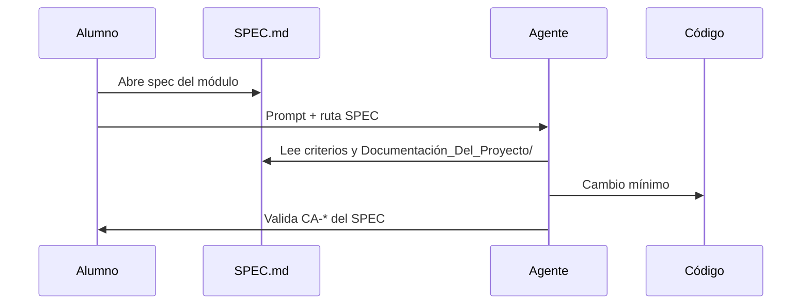

# Implementación — Spec-driven development (Cursor + Claude Code)

| Campo | Detalle |
|:------|:--------|
| **Empresa** | Lite Thinking |
| **Curso** | Microservicios con .NET en Kubernetes y Entornos Multicloud |
| **Instructor** | Lcc. Gilberto Valentino Juárez Sánchez |

**Requerimientos:** [REQUERIMIENTOS-SPEC-DRIVEN-DEVELOPMENT.md](./REQUERIMIENTOS-SPEC-DRIVEN-DEVELOPMENT.md)  
**Teoría:** [TEORIA-SPEC-DRIVEN-DEVELOPMENT.md](./TEORIA-SPEC-DRIVEN-DEVELOPMENT.md)

> Las plantillas viven en `spec-driven/`; este documento explica cómo **activarlas** en tu máquina.

---

## Índice

1. [Prerequisitos](#1-prerequisitos)
2. [Paso 1 — Revisar specs](#2-paso-1--revisar-specs)
3. [Paso 2 — Activar Cursor](#3-paso-2--activar-cursor)
4. [Paso 3 — Activar Claude Code](#4-paso-3--activar-claude-code)
5. [Paso 4 — Configurar MCP](#5-paso-4--configurar-mcp)
6. [Paso 5 — Flujo de trabajo diario](#6-paso-5--flujo-de-trabajo-diario)
7. [Paso 6 — Despliegue Azure con spec](#7-paso-6--despliegue-azure-con-spec)
8. [Paso 7 — Despliegue AWS con spec](#8-paso-7--despliegue-aws-con-spec)
9. [Solución de problemas](#9-solución-de-problemas)

---

## 1. Prerequisitos

- Repo ShopDemo clonado
- [Cursor](https://cursor.com) y/o [Claude Code](https://docs.anthropic.com/en/docs/claude-code) instalado
- .NET 10 SDK, Docker (para validar builds)
- Opcional: MCP Gateway local (`dotnet run --project Source/AI/ShopDemo.Mcp.Api`)

---

## 2. Paso 1 — Revisar specs

**Objetivo:** Conocer el mapa de especificaciones antes de activar herramientas.

| # | Acción |
|---|---|
| 1 | Abrir [specs/README.md](./specs/README.md) |
| 2 | Elegir el módulo del curso (ej. `06-deploy-azure`) |
| 3 | Leer `spec-driven/specs/<módulo>/SPEC.md` |
| 4 | Abrir los enlaces a `Documentación_Del_Proyecto/` indicados en el SPEC |

**Explicación:** El agente debe recibir siempre un SPEC concreto en el prompt; no improvisar sobre todo el monorepo.

---

## 3. Paso 2 — Activar Cursor

**Objetivo:** Copiar plantillas a la raíz del repo para que Cursor las cargue.

### Paso 2.1 — Rules

```powershell
cd I:\Curso\ShopDemo
New-Item -ItemType Directory -Force -Path .cursor\rules
Copy-Item spec-driven\cursor\templates\rules\*.mdc .cursor\rules\
```

**Explicación:** Los archivos `.mdc` aplican convenciones por glob (`Source/Catalog/**`, `k8s/**`, etc.).

### Paso 2.2 — Skills (proyecto)

```powershell
New-Item -ItemType Directory -Force -Path .cursor\skills
Copy-Item -Recurse spec-driven\cursor\templates\skills\* .cursor\skills\
```

### Paso 2.3 — AGENTS.md

```powershell
Copy-Item spec-driven\cursor\templates\AGENTS.md .\AGENTS.md
```

### Paso 2.4 — Verificar en Cursor

| # | En Cursor IDE |
|---|---|
| 1 | **Settings** → **Rules** — deben aparecer rules del proyecto |
| 2 | Abrir `Source/Catalog/` — rule `dotnet-csharp` debe aplicar |
| 3 | Prompt de prueba: *"Resume el SPEC 01-catalog y qué archivos no debo tocar"* |

---

## 4. Paso 3 — Activar Claude Code

**Objetivo:** Estructura `.claude/` según diagrama del curso.

### Paso 3.1 — Archivos raíz

```powershell
Copy-Item spec-driven\claude-code\templates\CLAUDE.md .\CLAUDE.md
Copy-Item spec-driven\claude-code\templates\CLAUDE.local.md.template .\CLAUDE.local.md
```

**Explicación:** `CLAUDE.local.md` es personal (gitignored); overrides sin commitear.

### Paso 3.2 — Carpeta .claude

```powershell
Copy-Item -Recurse spec-driven\claude-code\templates\.claude .\.claude
Copy-Item spec-driven\claude-code\templates\.claude\settings.local.json.template .\.claude\settings.local.json
```

### Paso 3.3 — Verificar

```bash
claude "List available slash commands and summarize CLAUDE.md project rules"
```

Deben existir commands: `/review`, `/deploy-azure`, `/deploy-aws`, `/implement-spec`.

---

## 5. Paso 4 — Configurar MCP

**Objetivo:** Conectar el agente al ShopDemo MCP Gateway.

### Plantilla

Archivos:

- Cursor: copiar `spec-driven/cursor/templates/mcp.template.json` → `.cursor/mcp.json`
- Claude: copiar `spec-driven/claude-code/templates/mcp.template.json` → `.mcp.json`

### Perfil local (ejemplo)

```json
{
  "mcpServers": {
    "shopdemo": {
      "url": "http://localhost:8005/mcp"
    }
  }
}
```

### Perfil Azure ACA

Sustituir URL por `https://<fqdn-ca-shopdemo-mcp>/mcp` (ver [IMPLEMENTACION-DESPLIEGUE-MCP-AZURE.md](../Documentación_Del_Proyecto/integracion-ia/IMPLEMENTACION-DESPLIEGUE-MCP-AZURE.md)).

### Perfil AWS ECS

`http://<alb-mcp-dns>/mcp`

**Explicación:** No commitear URLs con tokens; `.mcp.json` local puede quedar en `.gitignore` si contiene secretos.

---

## 6. Paso 5 — Flujo de trabajo diario



**Prompt plantilla (español):**

```
Implementa según spec-driven/specs/02-orders/SPEC.md.
Lee los REQUERIMIENTOS e IMPLEMENTACION enlazados antes de codificar.
Al finalizar, marca los criterios de aceptación cumplidos.
Responde al usuario en español.
```

---

## 7. Paso 6 — Despliegue Azure con spec

| # | Acción |
|---|---|
| 1 | Abrir [specs/06-deploy-azure/SPEC.md](./specs/06-deploy-azure/SPEC.md) |
| 2 | Cursor: invocar skill `deploy-azure` o rule equivalente |
| 3 | Claude Code: `/deploy-azure` |
| 4 | Seguir [IMPLEMENTACION-DESPLIEGUE-AZURE.md](../Documentación_Del_Proyecto/despliegue/azure/IMPLEMENTACION-DESPLIEGUE-AZURE.md) — Portal **y** CLI |
| 5 | MCP: [IMPLEMENTACION-DESPLIEGUE-MCP-AZURE.md](../Documentación_Del_Proyecto/integracion-ia/IMPLEMENTACION-DESPLIEGUE-MCP-AZURE.md) |

**Explicación:** El spec obliga a no mezclar comandos `aws` en la misma tarea.

---

## 8. Paso 7 — Despliegue AWS con spec

| # | Acción |
|---|---|
| 1 | [specs/07-deploy-aws/SPEC.md](./specs/07-deploy-aws/SPEC.md) |
| 2 | Claude: `/deploy-aws` |
| 3 | [IMPLEMENTACION-DESPLIEGUE-AWS.md](../Documentación_Del_Proyecto/despliegue/aws/IMPLEMENTACION-DESPLIEGUE-AWS.md) |
| 4 | MCP: [IMPLEMENTACION-DESPLIEGUE-MCP-AWS.md](../Documentación_Del_Proyecto/integracion-ia/IMPLEMENTACION-DESPLIEGUE-MCP-AWS.md) |

---

## 9. Solución de problemas

| Problema | Solución |
|---|---|
| Rules no aplican | Verificar `.cursor/rules/*.mdc` y reiniciar Cursor |
| Claude no ve CLAUDE.md | Ejecutar desde raíz del repo |
| MCP connection failed | `curl http://localhost:8005/health`; levantar APIs 8001–8004 |
| Agente mezcla Azure/AWS | Indicar SPEC `06` o `07` explícitamente |
| Commits con secretos | Usar solo `*.template` y `.local` gitignored |

---

## Checklist final

- [ ] `spec-driven/` presente en clone
- [ ] Cursor: `.cursor/rules` + `AGENTS.md`
- [ ] Claude: `CLAUDE.md` + `.claude/`
- [ ] MCP template configurado para tu entorno
- [ ] Un módulo probado con SPEC + criterios validados

---

## Referencias

- [cursor/README.md](./cursor/README.md)
- [claude-code/README.md](./claude-code/README.md)
