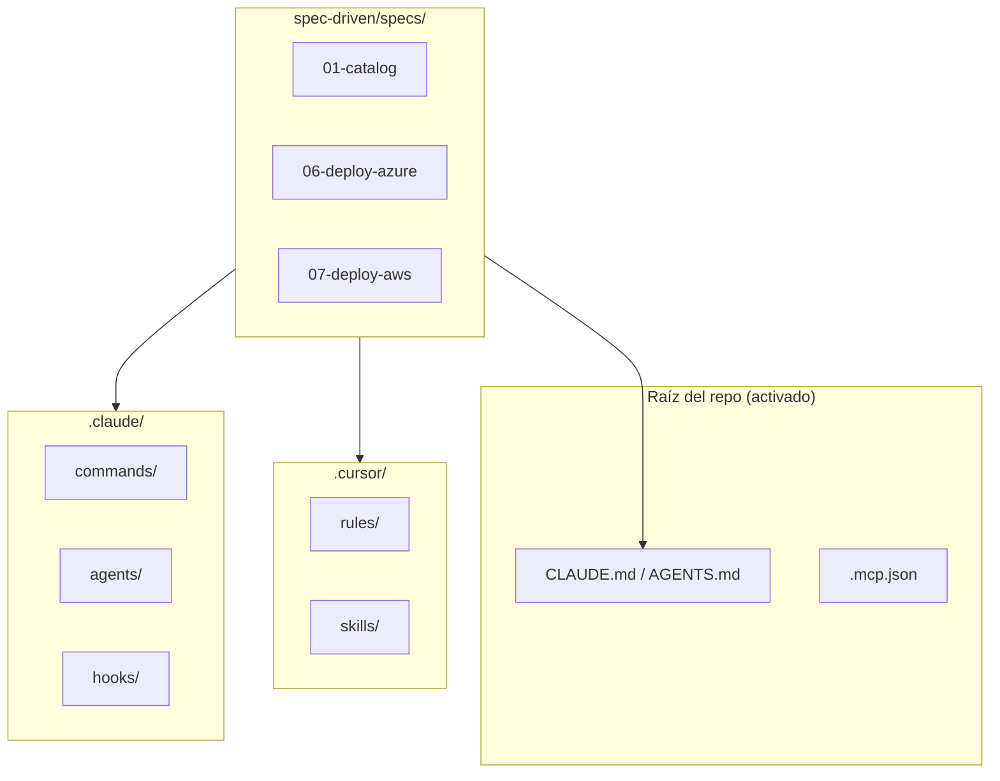

# Teoría — Spec-driven development (ShopDemo)

| Campo | Detalle |
|:------|:--------|
| **Empresa** | Lite Thinking |
| **Curso** | Microservicios con .NET en Kubernetes y Entornos Multicloud |
| **Instructor** | Lcc. Gilberto Valentino Juárez Sánchez |

---

## 1. ¿Qué es spec-driven development?

Es un flujo donde **la especificación escrita** (SPEC) guía al agente de IA **antes** del código:

1. Leer SPEC + documentos de requerimientos del curso
2. Planificar cambios acotados
3. Implementar
4. Validar criterios de aceptación

Reduce deriva arquitectónica en un monorepo con 5+ servicios y despliegue multicloud.

---

## 2. Cursor vs Claude Code

| Concepto | Cursor | Claude Code |
|---|---|---|
| Instrucciones globales | `AGENTS.md`, `.cursor/rules/*.mdc` | `CLAUDE.md` |
| Reglas modulares | Rules con `globs` | `.claude/rules/*.md` |
| Comandos repetibles | Skills / rules | `.claude/commands/*.md` |
| Sub-agentes | Task tool | `.claude/agents/*.md` |
| MCP | `.cursor/mcp.json` | `.mcp.json` |
| Local overrides | — | `CLAUDE.local.md`, `settings.local.json` |

ShopDemo versiona plantillas en `spec-driven/cursor/` y `spec-driven/claude-code/`; el alumno las **activa** en la raíz siguiendo la guía de implementación.

---

## 3. Estructura (basada en diagrama del curso)

---

## 4. Specs y documentación existente

Los archivos `spec-driven/specs/*/SPEC.md` **no duplican** los PDFs largos del curso: enlazan a `Documentación_Del_Proyecto/**/REQUERIMIENTOS` e `IMPLEMENTACION` y añaden criterios verificables para el agente.

---

## 5. Multicloud en specs

| Spec | Plataforma |
|---|---|
| `06-deploy-azure` | ACA, AKS, ACR |
| `07-deploy-aws` | ECS, EKS, ECR |
| `08-kubernetes` | Manifiestos comunes `k8s/` |
| `12-mcp-gateway` | Despliegue MCP en ambas nubes |

Commands/skills `deploy-azure` y `deploy-aws` están **separados** para evitar mezclar CLI de Azure y AWS en una misma sesión.

---

## Referencias

- [IMPLEMENTACION-SPEC-DRIVEN-DEVELOPMENT.md](./IMPLEMENTACION-SPEC-DRIVEN-DEVELOPMENT.md)
- [spec-driven/specs/README.md](./specs/README.md)
