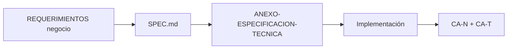

# Especificaciones ShopDemo

Cada carpeta define **qué** debe cumplir el agente antes y durante la implementación.

## Flujo spec-driven



**Guía de capas:** [GUIA-ESTRUCTURA-DOCUMENTACION.md](../../docs/GUIA-ESTRUCTURA-DOCUMENTACION.md)

Por módulo: `REQUERIMIENTOS` + `HISTORIAS-USUARIO` (negocio) → `ANEXO-ESPECIFICACION-TECNICA` + `ANEXO-HISTORIAS-TECNICAS` (técnico) → `ANEXO-PEDAGOGIA` (curso).

## Índice de specs

Cada `SPEC.md` enlaza la documentación en **3 capas** (negocio → técnica → pedagogía).

| Carpeta | SPEC | Requerimientos (negocio) |
|---|---|---|
| [00-vision](./00-vision/) | [SPEC.md](./00-vision/SPEC.md) | [RETO-TECNICO](../../docs/RETO-TECNICO-SHOPDEMO.md) |
| [01-catalog](./01-catalog/) | [SPEC.md](./01-catalog/SPEC.md) | [REQUERIMIENTOS-CATALOG](../../docs/catalog/REQUERIMIENTOS-CATALOG.md) |
| [02-orders](./02-orders/) | [SPEC.md](./02-orders/SPEC.md) | [REQUERIMIENTOS-ORDERS](../../docs/orders/REQUERIMIENTOS-ORDERS.md) |
| [03-inventory](./03-inventory/) | [SPEC.md](./03-inventory/SPEC.md) | [REQUERIMIENTOS-INVENTORY](../../docs/inventory/REQUERIMIENTOS-INVENTORY.md) |
| [04-analytics-aspire](./04-analytics-aspire/) | [SPEC.md](./04-analytics-aspire/SPEC.md) | [REQUERIMIENTOS-ANALYTICS](../../docs/analytics/REQUERIMIENTOS-ANALYTICS-ASPIRE.md) |
| [05-event-hubs](./05-event-hubs/) | [SPEC.md](./05-event-hubs/SPEC.md) | [INTEGRACION-EVENT-HUBS](../../docs/INTEGRACION-AZURE-EVENT-HUBS.md) |
| [06-deploy-azure](./06-deploy-azure/) | [SPEC.md](./06-deploy-azure/SPEC.md) | [REQUERIMIENTOS-AZURE](../../docs/despliegue/azure/REQUERIMIENTOS-DESPLIEGUE-AZURE.md) |
| [07-deploy-aws](./07-deploy-aws/) | [SPEC.md](./07-deploy-aws/SPEC.md) | [REQUERIMIENTOS-AWS](../../docs/despliegue/aws/REQUERIMIENTOS-DESPLIEGUE-AWS.md) |
| [08-kubernetes](./08-kubernetes/) | [SPEC.md](./08-kubernetes/SPEC.md) | [REQUERIMIENTOS-K8S](../../docs/despliegue/kubernetes/REQUERIMIENTOS-KUBERNETES.md) |
| [09-observabilidad](./09-observabilidad/) | [SPEC.md](./09-observabilidad/SPEC.md) | [REQUERIMIENTOS-OBS](../../docs/observabilidad/REQUERIMIENTOS-OBSERVABILIDAD.md) |
| [10-resiliencia](./10-resiliencia/) | [SPEC.md](./10-resiliencia/SPEC.md) | [REQUERIMIENTOS-RES](../../docs/resiliencia/REQUERIMIENTOS-RESILIENCIA.md) |
| [11-integracion-ia](./11-integracion-ia/) | [SPEC.md](./11-integracion-ia/SPEC.md) | [REQUERIMIENTOS-IA](../../docs/integracion-ia/REQUERIMIENTOS-INTEGRACION-IA.md) |
| [12-mcp-gateway](./12-mcp-gateway/) | [SPEC.md](./12-mcp-gateway/SPEC.md) | [REQUERIMIENTOS-MCP](../../docs/integracion-ia/REQUERIMIENTOS-DESPLIEGUE-MCP.md) |

## Uso con el agente

Prompt recomendado:

```
Implementa según spec-driven/specs/<carpeta>/SPEC.md.

Orden de lectura:
1. REQUERIMIENTOS + HISTORIAS-USUARIO (negocio)
2. ANEXO-ESPECIFICACION-TECNICA + ANEXO-HISTORIAS-TECNICAS
3. IMPLEMENTACION (si aplica)

Valida CA-N (negocio) y CA-T (técnico) al finalizar.
```
