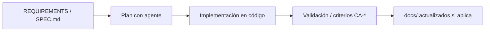

# Especificaciones ShopDemo

Cada carpeta define **qué** debe cumplir el agente antes y durante la implementación.

## Flujo spec-driven



## Índice de specs

| Carpeta | Área | Doc curso principal |
|---|---|---|
| [00-vision](./00-vision/) | Visión y E2E | [GUIA-ENDPOINTS.md](../../docs/GUIA-ENDPOINTS.md) |
| [01-catalog](./01-catalog/) | Catalog API | [docs/catalog/](../../docs/catalog/) |
| [02-orders](./02-orders/) | Orders API | [docs/orders/](../../docs/orders/) |
| [03-inventory](./03-inventory/) | Inventory API | [docs/inventory/](../../docs/inventory/) |
| [04-analytics-aspire](./04-analytics-aspire/) | Aspire + Analytics | [docs/analytics/](../../docs/analytics/) |
| [05-event-hubs](./05-event-hubs/) | Mensajería | [INTEGRACION-AZURE-EVENT-HUBS.md](../../docs/INTEGRACION-AZURE-EVENT-HUBS.md) |
| [06-deploy-azure](./06-deploy-azure/) | ACA + AKS | [docs/despliegue/azure/](../../docs/despliegue/azure/) |
| [07-deploy-aws](./07-deploy-aws/) | ECS + EKS | [docs/despliegue/aws/](../../docs/despliegue/aws/) |
| [08-kubernetes](./08-kubernetes/) | Minikube / K8s | [docs/despliegue/kubernetes/](../../docs/despliegue/kubernetes/) |
| [09-observabilidad](./09-observabilidad/) | Logs, métricas | [docs/observabilidad/](../../docs/observabilidad/) |
| [10-resiliencia](./10-resiliencia/) | Health, HPA | [docs/resiliencia/](../../docs/resiliencia/) |
| [11-integracion-ia](./11-integracion-ia/) | IA, SK, anomalías | [docs/integracion-ia/](../../docs/integracion-ia/) |
| [12-mcp-gateway](./12-mcp-gateway/) | MCP Server | [IMPLEMENTACION-DESPLIEGUE-MCP-AZURE.md](../../docs/integracion-ia/IMPLEMENTACION-DESPLIEGUE-MCP-AZURE.md) |

## Uso con el agente

Prompt recomendado:

```
Implementa según spec-driven/specs/<carpeta>/SPEC.md.
Lee los documentos enlazados antes de modificar código.
Valida los criterios de aceptación al finalizar.
```
